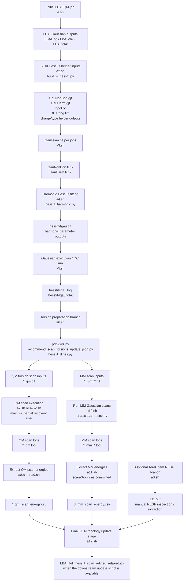

# Gaussian 09 + HessFit + TeraChem RESP Workflow for LBAI

## Script-aligned research workflow for HessFit harmonic fitting, RESP-charge integration, and torsion-scan refinement

**Repository focus:** a manuscript-companion style workflow for generating, checking, and refining molecular mechanics parameters for **LBAI** from Gaussian/HessFit calculations, with an optional TeraChem RESP-charge branch and a later torsion-scan refinement stage.

> **Documentation normalization note:** this README uses **LBAI** consistently as the target system. Any legacy molecule label previously appearing in shell-script filenames or downstream output names should be interpreted here as **LBAI** and, for a fully consistent working copy, renamed in the corresponding scripts/files as needed.

> **Scope note:** the committed `a*.sh` files should be read as a **scripted research workflow**, not as a single fully portable, molecule-agnostic orchestration layer. They encode a concrete multi-stage parameterization path, including main workflow stages, optional branches, and recovery utilities.

---

## Badges


---

# 1. Why this repository exists

This repository supports a staged molecular-parameterization workflow for **LBAI** that combines:

1. **Initial QM geometry/frequency calculations** in Gaussian 09.
2. **HessFit preprocessing** for generating Gaussian helper jobs and fitting inputs.
3. **Hessian-derived harmonic parameter construction** through `hessfit_harmonic.py`.
4. **Optional RESP-charge preparation** through an external TeraChem calculation.
5. **Torsion-scan job generation and scan-energy extraction** using HessFit-related utilities.
6. **Optional final `.itp` update logic** through a downstream pipeline script referenced by `a12.sh`.

The workflow is intended for research use where reproducibility depends on preserving:

- atom-order consistency,
- coordinate/topology agreement,
- charge consistency,
- explicit awareness of which shell scripts are primary production stages, optional utilities, or partial recovery jobs.

---

# 2. Graphical abstract / script-aligned workflow



---

# 3. Repository scope

This repository contains:

- HessFit-related Python modules and scripts.
- SLURM shell scripts named:
  - `a.sh`
  - `a0.sh`
  - `a2.sh` through `a12.sh`
  - auxiliary recovery scripts such as `a7-2.sh` and `a10-1.sh`
- LBAI-oriented structure/input files such as:
  - `LBAI.pdb`
  - `LBAI.itp`
  - `LBAI_scan_torsions.json`
  - `LBAI_torsion_refinement_candidates.csv`
- JSON option files such as:
  - `optfile.json`
  - `dihe_optfile.json`

The shell scripts encode the practical workflow order, but they are **not all equivalent in purpose**. Some represent core workflow stages, while others are targeted recovery or extraction utilities.

---

# 4. Script-by-script component map

| Script | Main action | Role in workflow | Important caveat |
|---|---|---|---|
| `a.sh` | Runs Gaussian on `LBAI.gjf`, then `formchk -3` | Initial QM reference job | Requires `LBAI.gjf` and Gaussian 09 environment |
| `a0.sh` | Runs TeraChem on `111.ts` | Optional RESP-charge branch launcher | Does not itself parse or patch RESP charges |
| `a2.sh` | Runs `build_4_hessfit.py optfile.json` | Generates HessFit helper inputs | Environment and paths are cluster-specific |
| `a3.sh` | Runs Gaussian on `GauNonBon.gjf` and `GauHarm.gjf` | Produces helper Gaussian logs/checkpoints | Requires the files produced by the build stage |
| `a4.sh` | Runs `hessfit_harmonic.py optfile.json` | Performs harmonic-fitting stage | Depends on prior Gaussian helper outputs |
| `a5.sh` | Runs Gaussian on `hessfit4gau.gjf` | Execution/QC run of generated HessFit Gaussian input | This is not a rigorous validation protocol by itself |
| `a6.sh` | Converts `LBAI.pdb` to XYZ, updates scan-torsion JSON, runs `hessfit_dihes.py` | Torsion setup and workflow launch | Bundles multiple logically distinct actions |
| `a7.sh` | Runs `hessfit_dihes.py dihe_optfile.json` | Torsion-workflow execution path | Functionally overlaps with the final part of `a6.sh` |
| `a7-2.sh` | Runs selected QM scan jobs such as `6_qm`, `4_qm`, `5_qm` | Partial recovery/restart utility | Not a full all-scan runner |
| `a8.sh` | Extracts QM scan energies from normally terminated `*_qm.log` files | QM energy extraction | Skips logs lacking `"Normal termination"` |
| `a9.sh` | Same QM extraction logic as `a8.sh` | Duplicate/extraction rerun utility | Redundant unless intentionally retained |
| `a10.sh` | Runs a hardcoded list of MM Gaussian scan jobs | MM scan execution | Explicit but not generalized |
| `a10-1.sh` | Clears and reruns `3_mm_*.gjf` jobs | Scan-3 MM recovery utility | Should be reviewed for command portability |
| `a11.sh` | Extracts MM energies from `3_mm_*.log` | MM energy extraction | Scan-3-only as committed |
| `a12.sh` | Runs `update_itp_full_pipeline.py` | Final LBAI `.itp` update stage | Uses permissive flags; referenced Python script must be available |

---

# 5. Combined workflow concept

The repository’s workflow can be interpreted as four linked phases:

1. **QM reference preparation**
2. **Harmonic HessFit parameter generation**
3. **Torsion-scan preparation, execution, and energy extraction**
4. **Final topology update / integration**

The workflow is sequential at a conceptual level, but the shell files are intentionally visible and modular rather than hidden behind one black-box driver script.

---

# 6. Phase I — Initial QM reference preparation

The initial Gaussian stage establishes the QM reference files that anchor the later HessFit workflow.

## `a.sh`

```bash
module load gaussian/g09
source $g09profile

g09 < LBAI.gjf > LBAI.log
formchk -3 LBAI.chk LBAI.fchk
```

## Purpose

- Run the initial LBAI Gaussian job.
- Produce the Gaussian log, checkpoint, and formatted checkpoint files needed by downstream tools.

## Expected outputs

```text
LBAI.log
LBAI.chk
LBAI.fchk
```

## Interpretation

This is the starting point for the script-aligned workflow. The exact chemical meaning of the Gaussian job depends on the contents of `LBAI.gjf`, but the shell-script role is unambiguous: execute Gaussian and convert the checkpoint to formatted-checkpoint form.

---

# 7. Optional RESP-charge branch

## `a0.sh`

```bash
terachem /home/user/woon/hessfit_work/LBAI/111.ts > 111.out
```

## Purpose

- Launch an external TeraChem calculation associated with LBAI.
- Provide an external output file that may be used to inspect or obtain RESP-related charge information, depending on the contents of `111.ts`.

## Expected output

```text
111.out
```

## What this script definitely does

- Executes TeraChem.
- Redirects stdout to `111.out`.

## What this script does **not** prove by itself

The shell script alone does not establish that it:

- automatically extracts RESP charges,
- automatically converts charges into `type_charge.txt`,
- patches HessFit files,
- validates charge totals.

Those actions are either manual, implemented elsewhere, or depend on additional scripts/files not shown by this launcher alone.

---

# 8. Phase II — HessFit harmonic parameter generation

The harmonic-fitting branch is the clearest staged sequence in the shell workflow:

```text
a2.sh → a3.sh → a4.sh → a5.sh
```

---

## 8.1 `a2.sh` — Build HessFit helper files

```bash
"$HESSPY" "$HESSDIR/build_4_hessfit.py" \
  optfile.json \
  --version g09 \
  --path /app/gaussian/g09 \
  --at scratch
```

## Purpose

- Prepare the HessFit-related helper files needed for subsequent Gaussian and harmonic-fitting stages.

## Inputs

```text
optfile.json
```

Additional required runtime context includes:

- the HessFit Python environment referenced by `$HESSPY`,
- the HessFit installation path referenced by `$HESSDIR`,
- a Gaussian 09 executable path passed via `--path`.

## Outputs implied by downstream scripts

Later scripts explicitly expect:

```text
GauNonBon.gjf
GauHarm.gjf
```

The broader workflow also uses supporting metadata such as:

```text
topol.txt
ff_string.txt
type_charge.txt
```

where present/generated in the associated HessFit workflow.

## Rigorous interpretation

`a2.sh` is the **HessFit input-building stage**. It does not itself run Gaussian; it prepares Gaussian/helper artifacts for later stages.

---

## 8.2 `a3.sh` — Gaussian helper jobs

```bash
g09 < GauNonBon.gjf > GauNonBon.log
formchk -3 GauNonBon.chk GauNonBon.fchk

g09 < GauHarm.gjf > GauHarm.log
formchk -3 GauHarm.chk GauHarm.fchk
```

## Purpose

- Execute the Gaussian helper calculations prepared upstream.
- Produce formatted checkpoint files consumed by HessFit harmonic fitting.

## Expected outputs

```text
GauNonBon.log
GauNonBon.chk
GauNonBon.fchk

GauHarm.log
GauHarm.chk
GauHarm.fchk
```

## Decision role in the pipeline

This stage is a computational bridge between:

- helper-input construction (`a2.sh`), and
- harmonic fitting (`a4.sh`).

---

## 8.3 `a4.sh` — Harmonic HessFit fitting

```bash
"$HESSPY" "$HESSDIR/hessfit_harmonic.py" \
  optfile.json \
  --version g09 \
  --at scratch
```

## Purpose

- Execute the HessFit harmonic fitting stage using the prepared inputs and prior Gaussian outputs.

## Inputs

At minimum, this stage depends on:

- `optfile.json`,
- Gaussian-derived helper outputs from `a3.sh`,
- the HessFit Python environment.

## Outputs

The subsequent shell script expects:

```text
hessfit4gau.gjf
```

Additional parameter artifacts may also be created according to the behavior of the underlying HessFit code and JSON configuration.

## Rigorous interpretation

This is the central **harmonic parameter-fitting** step in the script-aligned workflow.

---

## 8.4 `a5.sh` — Gaussian execution / QC run of generated HessFit force-field input

```bash
g09 < hessfit4gau.gjf > hessfit4gau.log
formchk -3 hessfit4gau.chk hessfit4gau.fchk
```

## Purpose

- Execute the generated Gaussian input produced by the harmonic-fitting stage.
- Confirm that the generated input is runnable and produces Gaussian outputs.

## Expected outputs

```text
hessfit4gau.log
hessfit4gau.chk
hessfit4gau.fchk
```

## Correct scientific interpretation

This stage is best described as an:

> **execution/QC run** of the generated HessFit Gaussian input.

It should not be overstated as a complete parameter-validation framework unless additional quantitative comparison criteria are applied outside this script.

---

# 9. Phase III — Torsion-scan preparation and refinement workflow

The torsion branch is operationally more complex than the harmonic branch because the shell scripts include:

- setup scripts,
- scan launchers,
- partial restart helpers,
- separate QM and MM extraction steps.

A conservative conceptual ordering is:

```text
a6.sh
↓
QM scan execution: a7.sh and/or targeted recovery via a7-2.sh
↓
QM energy extraction: a8.sh or a9.sh
↓
MM scan execution: a10.sh or recovery via a10-1.sh
↓
MM energy extraction: a11.sh
```

---

## 9.1 `a6.sh` — Combined LBAI torsion setup script

```bash
python "$HESSDIR/pdb2xyz.py" LBAI.pdb LBAI.xyz

python "$HESSDIR/recommend_scan_torsions_update_json.py" \
  LBAI.itp \
  LBAI.xyz \
  --update-json dihe_optfile.json \
  --yes

"$HESSPY" "$HESSDIR/hessfit_dihes.py" dihe_optfile.json
```

## Purpose

`a6.sh` combines three tasks:

1. Convert:
   ```text
   LBAI.pdb → LBAI.xyz
   ```
2. Update torsion-scan recommendations in:
   ```text
   dihe_optfile.json
   ```
3. Launch:
   ```text
   hessfit_dihes.py
   ```

## Inputs

```text
LBAI.pdb
LBAI.itp
dihe_optfile.json
```

## Outputs and side effects

The script may:

- overwrite or regenerate `LBAI.xyz`,
- modify `dihe_optfile.json`,
- generate torsion-related downstream inputs through `hessfit_dihes.py`.

## Methodological caution

Because the script both:

- modifies the scan-definition JSON, and
- immediately runs the dihedral workflow,

it is less auditable than a manually separated process. For publication-readiness, the torsion-selection decision should be preserved or reviewed explicitly before downstream scan generation.

---

## 9.2 `a7.sh` — Dihedral workflow execution path

```bash
cd /home/user/woon/hessfit_work/LBAI
"$HESSPY" "$HESSDIR/hessfit_dihes.py" dihe_optfile.json
```

## Purpose

- Run the HessFit dihedral workflow directly from the LBAI working directory.

## Relationship to `a6.sh`

The final line of `a6.sh` already invokes:

```bash
hessfit_dihes.py dihe_optfile.json
```

Therefore, `a7.sh` should be interpreted as:

- a standalone re-execution path,
- a rerun helper,
- or a script used when the JSON/XYZ preparation stages have already been completed.

It is not necessarily an additional mandatory stage after `a6.sh` unless the project-specific workflow requires rerunning the dihedral generator.

---

## 9.3 `a7-2.sh` — Partial QM scan recovery / targeted execution

```bash
g09 < 6_qm.gjf > 6_qm.log
formchk -3 6_qm.chk 6_qm.fchk

g09 < 4_qm.gjf > 4_qm.log
formchk -3 4_qm.chk 4_qm.fchk

g09 < 5_qm.gjf > 5_qm.log
formchk -3 5_qm.chk 5_qm.fchk
```

## Purpose

- Execute a selected subset of QM torsion-scan jobs.
- Generate corresponding log and formatted checkpoint files.

## Expected outputs

```text
6_qm.log
6_qm.chk
6_qm.fchk

4_qm.log
4_qm.chk
4_qm.fchk

5_qm.log
5_qm.chk
5_qm.fchk
```

## Interpretation

This is a **partial recovery or continuation script**, not a general complete QM scan launcher.

---

# 10. QM torsion-scan energy extraction

## 10.1 `a8.sh`

```bash
for f in *_qm.log; do
    if grep -q "Normal termination" "$f"; then
        base="${f%.log}"
        "$HESSPY" "$HESSDIR/log2scan.py" \
            -t qm \
            -f "$f" \
            -o "${base}_scan_energy.csv"
    else
        echo "Skipping failed log: $f"
    fi
done
```

## 10.2 `a9.sh`

`a9.sh` implements the same logic as `a8.sh`.

## Purpose

- Traverse all available QM scan logs matching:
  ```text
  *_qm.log
  ```
- Process only those logs that contain:
  ```text
  Normal termination
  ```
- Convert each accepted Gaussian log into a scan-energy CSV file.

## Output naming convention

For an input:

```text
3_qm.log
```

the script emits:

```text
3_qm_scan_energy.csv
```

## Decision logic

A QM log is included when:

```bash
grep -q "Normal termination" "$f"
```

This is a useful runtime-completion filter, but it is not equivalent to verifying:

- conformational adequacy,
- scan continuity,
- absence of unstable structures,
- sufficient coverage of torsional space,
- scientific acceptance of the resulting energy surface.

## README-level recommendation

Unless both scripts have a workflow-specific archival reason, `a8.sh` and `a9.sh` could be consolidated into one canonical QM extraction script.

---

# 11. MM torsion-scan execution and extraction

## 11.1 `a10.sh` — Hardcoded MM Gaussian scan launcher

`a10.sh` runs a fixed list of MM scan Gaussian inputs with filenames such as:

```text
0_mm_0.gjf
0_mm_96.gjf
...
6_mm_960.gjf
```

## Purpose

- Execute a pre-enumerated set of MM-side scan jobs.
- Generate MM scan Gaussian logs for later energy extraction.

## Interpretation

This script is explicit rather than generalized:

- it hardcodes expected files,
- it assumes the files already exist,
- it is convenient for reproducing a known scan bundle,
- it is not automatically adaptive if scan-point counts or scan IDs change.

---

## 11.2 `a10-1.sh` — Scan-3 MM recovery utility

```bash
grm -f 3_mm_*.log 3_mm_*.chk

for f in 3_mm_*.gjf; do
    base="${f%.gjf}"
    echo "Running $f"
    g09 "$f" "${base}.log"
done
```

## Purpose

- Remove existing scan-3 MM outputs.
- Rerun scan-3 MM Gaussian jobs.

## Caution

This script should be reviewed before reuse because:

1. `grm` is not standard POSIX shell syntax and may be:
   - a local alias,
   - a cluster-specific wrapper,
   - or an unintended typo.
2. The Gaussian invocation syntax differs from the redirection style used elsewhere in the repository.

For publication-grade reproducibility, this recovery script should be normalized and documented.

---

## 11.3 `a11.sh` — Scan-3 MM energy extraction

```bash
"$HESSPY" "$HESSDIR/get_mm_energy.py" \
  -t mm \
  3_mm_*.log \
  -o 3_mm_scan_energy.csv
```

## Purpose

- Extract MM scan energies from scan-3 log files only.

## Output

```text
3_mm_scan_energy.csv
```

## Important limitation

As committed, `a11.sh` is **not** a full MM extraction stage across every scan. It targets only:

```text
3_mm_*.log
```

If equivalent CSV outputs are needed for all scans, separate commands or a generalized loop would be required.

---

# 12. Phase IV — Final LBAI topology update stage

## `a12.sh`

```bash
python update_itp_full_pipeline.py \
  --data ./data \
  --base-itp LBAI.itp \
  --dihe-json dihe_optfile.json \
  --charges type_charge.txt \
  --ff-string ff_string.txt \
  --output-itp LBAI_full_hessfit_scan_refined_relaxed.itp \
  --allow-incomplete \
  --expected-points 7 \
  --allow-high-rmse
```

## Purpose

- Run a downstream topology-update pipeline for LBAI.
- Combine base topology information, dihedral refinement data, charges, and fitted force-field information into a final `.itp` output.

## Inputs

```text
./data
LBAI.itp
dihe_optfile.json
type_charge.txt
ff_string.txt
```

## Output

```text
LBAI_full_hessfit_scan_refined_relaxed.itp
```

## Decision logic implied by the command

The script is intentionally run in a permissive mode:

```text
--allow-incomplete
--allow-high-rmse
```

It also declares:

```text
--expected-points 7
```

Therefore, the update step should be interpreted as a:

> **relaxed refinement/integration stage**, not a strict automatic acceptance filter.

## Repository-completeness note

The downstream script:

```text
update_itp_full_pipeline.py
```

must be present and version-controlled for the `a12.sh` stage to be reproducible. If it is maintained outside the visible repository root, its location and provenance should be documented explicitly.

---

# 13. Outputs produced by each workflow segment

| Workflow segment | Representative outputs |
|---|---|
| Initial LBAI Gaussian reference job | `LBAI.log`, `LBAI.chk`, `LBAI.fchk` |
| Optional TeraChem branch | `111.out` |
| HessFit build stage | `GauNonBon.gjf`, `GauHarm.gjf`, helper topology/parameter artifacts |
| Gaussian helper jobs | `GauNonBon.log`, `GauNonBon.fchk`, `GauHarm.log`, `GauHarm.fchk` |
| Harmonic fitting | `hessfit4gau.gjf`, fitted helper outputs |
| Gaussian execution/QC | `hessfit4gau.log`, `hessfit4gau.fchk` |
| Torsion setup | `LBAI.xyz`, updated `dihe_optfile.json`, scan inputs |
| QM scan execution | `*_qm.log`, `*_qm.chk`, `*_qm.fchk` |
| QM energy extraction | `*_qm_scan_energy.csv` |
| MM scan execution | `*_mm_*.log`, MM checkpoint artifacts where applicable |
| MM scan-3 extraction | `3_mm_scan_energy.csv` |
| Final topology integration | `LBAI_full_hessfit_scan_refined_relaxed.itp` |

---

# 14. Confidence / decision logic

## 14.1 High-confidence statements directly supported by the shell workflow

- `a.sh` starts the LBAI Gaussian reference calculation pattern.
- `a0.sh` launches a TeraChem job and writes `111.out`.
- `a2.sh → a3.sh → a4.sh → a5.sh` forms the primary harmonic-fitting branch.
- `a6.sh` performs coordinate conversion, torsion JSON update, and dihedral workflow launch.
- `a7.sh` provides a direct dihedral workflow execution path.
- `a7-2.sh` reruns only selected QM scan jobs.
- `a8.sh` and `a9.sh` apply the same normal-termination-gated QM energy extraction logic.
- `a10.sh` executes a hardcoded MM scan list.
- `a10-1.sh` is a scan-3 rerun/recovery utility.
- `a11.sh` extracts only scan-3 MM energies.
- `a12.sh` performs a permissive final `.itp` update stage when its referenced update script is available.

## 14.2 Reasonable interpretations

- The TeraChem branch is intended to support RESP-charge generation or inspection.
- The final topology update stage is intended to merge harmonic and torsion-refinement products into a refined LBAI topology.
- The recovery scripts exist to support partial reruns after scan failures or job interruptions.

## 14.3 Claims intentionally not made

This README does **not** claim:

- one-command end-to-end orchestration,
- strict final validation,
- automatic RESP-charge extraction,
- complete all-scan MM post-processing in `a11.sh`,
- a fully portable software environment,
- molecular naming/path normalization in the shell files unless those files are edited accordingly.

---

# 15. repository layout


```text
.
├── README.md
├── scripts/
│   ├── slurm/
│   │   ├── a.sh
│   │   ├── a0.sh
│   │   ├── a2.sh
│   │   ├── ...
│   │   └── a12.sh
│   └── postprocess/
│       └── update_itp_full_pipeline.py
├── hessfit/
│   ├── build_4_hessfit.py
│   ├── hessfit_harmonic.py
│   ├── hessfit_dihes.py
│   ├── pdb2xyz.py
│   ├── log2scan.py
│   └── get_mm_energy.py
├── examples/
│   └── LBAI/
│       ├── LBAI.gjf
│       ├── LBAI.pdb
│       ├── LBAI.itp
│       ├── optfile.json
│       └── dihe_optfile.json
└── data/
    └── generated or curated scan outputs
```

This layout is a recommended organization, not a statement that the current repository is already arranged this way.

---

# 16. Suggested software environment

The shell scripts imply a cluster-oriented environment.

## External executables

- Gaussian 09
- `formchk`
- TeraChem, for the optional branch
- SLURM submission tools such as `sbatch`

## Python environment pattern

The scripts use:

```bash
module load miniconda/24.1.2
source activate /home/user/woon/ML
```

and define:

```bash
export HESSDIR="/home/user/woon/ML/lib/python3.9/site-packages/hessfit"
export HESSPY="/home/user/woon/ML/bin/python"
```

## Portability note

These paths are absolute and user-specific. For reuse by another researcher or cluster, they should be replaced with:

- documented environment variables,
- a project-local conda environment,
- or a small configuration file sourced by all shell scripts.

---

# 17. Quick start commands

## 17.1 Initial LBAI Gaussian reference job

```bash
sbatch a.sh
```

Expected primary outputs:

```text
LBAI.log
LBAI.chk
LBAI.fchk
```

---

## 17.2 Optional TeraChem branch

```bash
sbatch a0.sh
```

Expected output:

```text
111.out
```

Follow-up review should confirm whether the TeraChem job produced the charge information intended for later integration.

---

## 17.3 Harmonic HessFit branch

Run in order:

```bash
sbatch a2.sh
sbatch a3.sh
sbatch a4.sh
sbatch a5.sh
```

Conceptual sequence:

```text
build helper files
→ run Gaussian helper jobs
→ fit harmonic parameters
→ execute/QC generated Gaussian force-field input
```

---

## 17.4 Torsion setup and scan-processing branch

Launch combined torsion preparation:

```bash
sbatch a6.sh
```

Use direct rerun/execution where appropriate:

```bash
sbatch a7.sh
```

Use partial QM recovery only where needed:

```bash
sbatch a7-2.sh
```

Extract QM energies:

```bash
sbatch a8.sh
```

or:

```bash
sbatch a9.sh
```

Run MM scan jobs:

```bash
sbatch a10.sh
```

Use scan-3 MM recovery only when needed:

```bash
sbatch a10-1.sh
```

Extract scan-3 MM energies:

```bash
sbatch a11.sh
```

---

## 17.5 Final topology integration

```bash
sbatch a12.sh
```

Expected final output:

```text
LBAI_full_hessfit_scan_refined_relaxed.itp
```

This stage requires the downstream update script referenced in `a12.sh`.

---

# 18. How to use the workflows together

A conservative script-aligned operational order is:

```text
Optional charge branch:
a0.sh

Reference + harmonic branch:
a.sh
a2.sh
a3.sh
a4.sh
a5.sh

Torsion branch:
a6.sh
a7.sh only if direct rerun/execution is needed
a7-2.sh only for selected QM recovery jobs
a8.sh or a9.sh
a10.sh
a10-1.sh only for scan-3 MM recovery
a11.sh for scan-3 MM extraction

Final integration:
a12.sh
```

For a clean publication workflow, the researcher should record:

- which scripts were run,
- which recovery scripts were used,
- whether TeraChem-derived charge information was included,
- whether permissive final-update flags were retained,
- which scan outputs were available at topology-update time.

---

# 19. Reproducibility notes

For publication-quality reproducibility:

1. Preserve the exact shell scripts used for the reported results.
2. Record the exact Gaussian 09 and TeraChem software versions.
3. Archive:
   - all `.gjf` inputs,
   - all `.log` outputs,
   - all `.chk` and `.fchk` files needed for traceability,
   - JSON configuration files,
   - torsion recommendation outputs,
   - scan energy CSV files,
   - final `.itp` files.
4. Record whether JSON files were manually reviewed after `a6.sh`.
5. Record whether `a8.sh` or `a9.sh` was used.
6. Record whether any scan recovery scripts were needed.
7. Record whether `a12.sh` was run with:
   - `--allow-incomplete`
   - `--allow-high-rmse`
8. Commit or archive `update_itp_full_pipeline.py` together with the reported results.
9. Replace hardcoded absolute paths if the workflow is intended for external reproduction.

---

# 20. Methodological contribution / interpretation

This repository contributes a transparent, file-explicit workflow for LBAI force-field development that links:

- Gaussian 09 reference calculations,
- HessFit harmonic parameter generation,
- optional external RESP-charge support through TeraChem,
- torsion-scan preparation,
- QM/MM scan energy extraction,
- topology-update integration.

The workflow is scientifically useful because it keeps intermediate files and decision points visible. Rather than hiding the workflow in a single opaque launcher, it exposes:

- what was run,
- in what order,
- with which intermediate artifacts,
- and where manual or permissive decisions enter the parameterization process.

---

# 21. Example citation block

```bibtex
@software{lbai_hessfit_workflow,
  title        = {LBAI Gaussian--HessFit Workflow for Harmonic Parameterization and Torsion-Scan Refinement},
  author       = {Repository maintainers},
  year         = {2026},
  note         = {Research workflow repository integrating Gaussian 09, HessFit, optional TeraChem calculations, torsion-scan processing, and topology-update utilities}
}
```

---


# 22. Limitations

- The workflow is cluster-specific as written.
- Absolute user paths appear in several scripts.
- Some scripts are recovery helpers rather than general-purpose pipeline stages.
- The optional TeraChem launcher does not, by itself, establish automated charge extraction.
- `a8.sh` and `a9.sh` are redundant in their current form.
- `a11.sh` extracts only scan-3 MM energies.
- `a10-1.sh` requires portability review.
- The final update stage depends on the availability of `update_itp_full_pipeline.py`.
- The permissive flags in `a12.sh` mean that the final topology update should not automatically be interpreted as a strict acceptance-filtered result.

---

# 23. Acknowledgments

This repository organizes a research workflow around:

- Gaussian-based molecular calculations,
- HessFit parameterization utilities,
- optional TeraChem-based charge calculations,
- torsion-scan refinement logic,
- topology post-processing for force-field construction.

---

# 25. Maintainer note

The shell scripts are valuable because they preserve the real operational order of the workflow. To maximize publication readiness, each script should remain explicitly categorized as one of:

- **main workflow stage**
- **optional branch**
- **recovery utility**
- **downstream integration stage**

The README should be updated whenever script names, generated filenames, or acceptance logic change.
