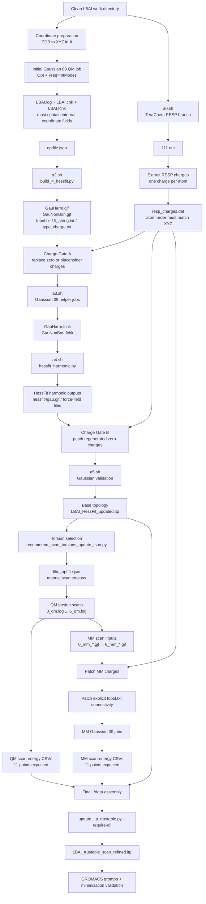

# Gaussian 09 Revision C.01 + HessFit + TeraChem RESP User Manual

## End-to-end workflow for producing a trustworthy HessFit/QM-MM-refined GROMACS `.itp`

**Target molecule in the supplied scripts:** `LBAI`  
**Gaussian target version:** Gaussian 09, Revision C.01  
**Final target topology:** `LBAI_trustable_scan_refined.itp`  
**Final audit directory:** `./data/itp_update_output`  
**Charge source for this workflow:** TeraChem RESP-charge branch (`a0.sh`)  
**Main Gaussian/HessFit branch:** `a2.sh` through `a11.sh`, with corrected sequencing and recovery logic  
**Final topology update script:** `update_itp_trustable.py`

---

# 0. Executive summary

This workflow has three logically separate parameterization layers that must not be mixed together:

1. **Geometry/topology consistency layer**  
   The PDB, XYZ, Gaussian input, HessFit topology, and GROMACS `.itp` must all use the same atom order.

2. **HessFit harmonic layer**  
   Gaussian 09 QM Hessian information and Gaussian Amber-style MM helper jobs are used by HessFit to update bonded parameters such as bonds, angles, and initial torsions.

3. **QM/MM torsion-scan refinement layer**  
   Selected torsions are scanned at the QM level, the corresponding MM scan energies are computed, and the residual profile is fitted back into the GROMACS `[ dihedrals ]` section.

The final `.itp` should only be trusted if all of the following are true:

- coordinates are in Ångström,
- atom order is consistent across PDB, XYZ, Gaussian inputs, HessFit files, and `.itp`,
- RESP charges from TeraChem have replaced Python-generated zero or placeholder charges where required,
- `topol.txt` agrees with the `.itp` bonded structure,
- Gaussian 09 jobs terminate normally,
- QM and MM scan-energy CSV files exist,
- QM/MM scan point counts match,
- fitted torsion RMSE values are acceptable,
- fitted torsion force constants are chemically reasonable,
- GROMACS `grompp` accepts the final topology,
- a short minimization is stable.

The most important correction is this:

> `a0.sh` is not an unrelated script. In this project it is the RESP-charge branch. The HessFit/Gaussian Python pathway can generate zero-charge placeholders. Those must be replaced by TeraChem-derived RESP charges before MM nonbonded work, MM scan work, and final `.itp` use.

---

# 1. Role of every `a*.sh` script

| Script | Correct role | Use status | Critical notes |
|---|---|---:|---|
| `a0.sh` | TeraChem RESP-charge calculation branch | Required if RESP charges are the intended final charges | Runs TeraChem on `111.ts` and writes `111.out`. It does not itself extract or patch charges. |
| `a2.sh` | Build HessFit Gaussian helper files | Required | Runs `build_4_hessfit.py optfile.json --version g09 --path /app/gaussian/g09 --at scratch`. |
| `a3.sh` | Run Gaussian helper MM jobs | Required | Runs `GauNonBon.gjf` and `GauHarm.gjf`, then `formchk -3`. |
| `a4.sh` | Fit HessFit harmonic parameters | Required | Runs `hessfit_harmonic.py optfile.json --version g09 --at scratch`. |
| `a5.sh` | Validate generated HessFit Gaussian input | Strongly recommended | Runs `hessfit4gau.gjf` and formats `hessfit4gau.chk`. |
| `a6.sh` | Torsion setup and launcher | Use carefully | Converts PDB to XYZ, recommends torsions, updates `dihe_optfile.json`, then calls `hessfit_dihes.py`. It is not just a preparation script. |
| `a7.sh` | "$HESSPY" "$HESSDIR/hessfit_dihes.py" dihe_optfile.json | Required| A complete QM scan file generator. |
| `a7-2.sh` | Partial QM rerun for scans 4, 5, and 6 | Recovery only | Not a complete QM scan runner. |
| `a8.sh` | Extract QM scan energies | Required after QM logs exist | Loops over `*_qm.log` and writes `*_qm_scan_energy.csv` for normally terminated logs. |
| `a9.sh` | Generate MM Gaussian File |  |  |
| `a10.sh` | Hardcoded serial MM Gaussian execution | Legacy or recovery | Explicitly runs many `N_mm_angle.gjf` files. It is not flexible but is transparent. |
| `a10-1.sh` | Partial scan-3 MM rerun | Recovery only | Contains `grm`, which is probably site-specific or a typo. Use `rm` unless `grm` is known on your cluster. |
| `a11.sh` | Extract scan-3 MM energies only | Recovery only | Extracts only `3_mm_scan_energy.csv`; not a complete all-scan extraction script. |
| 'a12.sh'| run update_itp_full_pipeline.py| | |

---

# 2. Sequential flow

The safest full sequence is:

```text
Phase 0   Create clean directory and environment
Phase 1   Prepare and verify coordinates
Phase 2   Run initial Gaussian 09 QM opt/freq job manually
Phase 3   Run TeraChem RESP charge branch using a0.sh
Phase 4   Extract/curate RESP charges into one-charge-per-atom format
Phase 5   Create optfile.json
Phase 6   Run a2.sh to build GauHarm.gjf and GauNonBon.gjf
Phase 7   Charge Gate A: patch RESP charges into generated MM/helper files
Phase 8   Run a3.sh to produce GauHarm.fchk and GauNonBon.fchk
Phase 9   Run a4.sh to fit harmonic HessFit parameters
Phase 10  Charge Gate B: patch any regenerated zero-charge files
Phase 11  Run a5.sh to validate hessfit4gau.gjf
Phase 12  Prepare LBAI_HessFit_updated.itp as base topology
Phase 13  Select torsions using the recommender, not blind element matching
Phase 14  Prepare dihe_optfile.json
Phase 15  Generate/run QM torsion scans
Phase 16  Extract QM scan energies and verify 11 points per scan
Phase 17  Generate MM scan Gaussian files
Phase 18  Patch MM atom-line charges and explicit connectivity
Phase 19  Run MM Gaussian jobs
Phase 20  Extract MM scan energies and verify 11 points per scan
Phase 21  Diagnose scan completeness and repair failed scans
Phase 22  Assemble final ./data directory
Phase 23  Run update_itp_trustable.py in strict mode  https://github.com/ph7klw76/HessFittoGromacsitp
Phase 24  Validate final .itp with GROMACS
```

The dependency rule is:

> Never move to the next phase because a job merely finished. Move to the next phase only when the phase-specific acceptance gate passes.

---

# 3. Workflow diagram



---

# 4. Directory structure

Use a clean working directory. Do not mix old failed logs with new successful logs unless they are clearly backed up.

```bash
mkdir -p /home/user/woon/hessfit_work/LBAI
cd /home/user/woon/hessfit_work/LBAI
mkdir -p data logs backup scripts
```

Recommended structure during the work:

```text
/home/user/woon/hessfit_work/LBAI/
├── LBAI.pdb
├── LBAI.xyz
├── LBAI.gjf
├── LBAI.log
├── LBAI.chk
├── LBAI.fchk
├── optfile.json
├── dihe_optfile.json
├── 111.ts
├── 111.out
├── resp_charges.dat
├── GauHarm.gjf
├── GauHarm.log
├── GauHarm.chk
├── GauHarm.fchk
├── GauNonBon.gjf
├── GauNonBon.log
├── GauNonBon.chk
├── GauNonBon.fchk
├── hessfit4gau.gjf
├── hessfit4gau.log
├── hessfit4gau.chk
├── hessfit4gau.fchk
├── topol.txt
├── ff_string.txt
├── type_charge.txt
├── dihedrals/
│   ├── 0_qm.gjf
│   ├── 0_qm.log
│   ├── 0_qm_scan_energy.csv
│   ├── 0_mm_0.gjf
│   ├── 0_mm_0.log
│   ├── 0_mm_scan_energy.csv
│   └── ...
└── data/
    ├── LBAI.xyz
    ├── topol.txt
    ├── LBAI_HessFit_updated.itp
    ├── LBAI_torsion_refinement_candidates.csv
    ├── 0_qm_scan_energy.csv
    ├── 0_mm_scan_energy.csv
    ├── ...
    └── itp_update_output/
```

The final `./data` folder should contain only the final accepted versions of inputs and diagnostic logs.

---

# 5. Environment setup for Gaussian 09 Rev. C.01 and HessFit

Every SLURM script that runs HessFit or Gaussian should load the same environment.

```bash
module load miniconda/24.1.2
module load gaussian/g09

source activate /home/user/woon/ML

export HESSDIR="/home/user/woon/ML/lib/python3.9/site-packages/hessfit"
export HESSPY="/home/user/woon/ML/bin/python"
export PYTHONPATH="$HESSDIR:$PYTHONPATH"
export PATH="$HESSDIR:$PATH"

export g09root="/app/gaussian"
export GAUSS_EXEDIR="/app/gaussian/g09"
export PATH="/app/gaussian/g09:$PATH"
```

Verify the environment:

```bash
which "$HESSPY"
which g09
echo "$HESSDIR"
echo "$GAUSS_EXEDIR"
ls -l /app/gaussian/g09/g09
ls -l /app/gaussian/g09/l1.exe
```

Expected:

```text
/app/gaussian/g09/g09
/app/gaussian/g09/l1.exe
```

If Gaussian fails with:

```text
No executable for file l1.exe.
Search path GAUSS_EXEDIR is ""
```

then the Gaussian environment is not loaded correctly. Fix `source $g09profile`, `GAUSS_EXEDIR`, or the module before submitting long jobs.

---

# 6. Phase 1 — Prepare the coordinate file correctly

## 6.1 Convert PDB to XYZ only if the PDB atom order is final

If starting from `LBAI.pdb`:

```bash
python "$HESSDIR/pdb2xyz.py" LBAI.pdb LBAI.xyz
```

Only use Bohr-to-Å conversion if the source coordinates are truly in Bohr:

```bash
python "$HESSDIR/pdb2xyz.py" LBAI.pdb LBAI.xyz --bohr-to-ang
```

Do not apply `--bohr-to-ang` to normal PDB coordinates. Normal PDB coordinates are already Ångström.

## 6.2 Coordinate-unit sanity check

Run:

```bash
python - << 'PY'
from pathlib import Path
import math

xyz = Path("LBAI.xyz")
lines = xyz.read_text().splitlines()
nat = int(lines[0].split()[0])
atoms = []

for line in lines[2:2+nat]:
    p = line.split()
    atoms.append((p[0], tuple(map(float, p[1:4]))))

pairs = [(1, 2), (2, 3), (2, 10)]

for a, b in pairs:
    ea, ra = atoms[a-1]
    eb, rb = atoms[b-1]
    d = math.dist(ra, rb)
    print(f"{a}-{b} {ea}-{eb}: {d:.4f} Å")
PY
```

Approximate expected values:

```text
C-H ≈ 1.08–1.10 Å
C-C aromatic ≈ 1.38–1.45 Å
```

If a C-H bond is around `2.08 Å`, the file is probably in Bohr and should be converted.

## 6.3 Atom-order invariant

From this point onward, do not reorder atoms. The following files must use the same atom order:

```text
LBAI.pdb
LBAI.xyz
LBAI.gjf
LBAI.log
LBAI.fchk
topol.txt
type_charge.txt
dihe_optfile.json scan_torsions
LBAI_HessFit_updated.itp
all QM scan files
all MM scan files
final LBAI_trustable_scan_refined.itp
```

A charge file with the correct numeric charges but wrong atom order is worse than a missing charge file because it produces a chemically misleading topology.

---

# 7. Phase 2 — Initial Gaussian 09 QM job for HessFit

The uploaded `a*.sh` set does not include the initial Gaussian QM opt/freq job. This job must already exist before `a2.sh`.

HessFit requires a Gaussian formatted checkpoint containing internal-coordinate information. The `.fchk` must contain fields such as:

```text
Redundant internal dimensions
Internal Forces
Internal Force Constants
Cartesian Force Constants
```

Use a route similar to:

```text
%chk=LBAI.chk
%nprocshared=16
%mem=48GB
#p B3LYP/6-31G* Opt Freq=IntModes geom=connectivity

LBAI opt freq for HessFit

0 1
... coordinates ...

... connectivity block ...
```

For difficult systems, use robust SCF options:

```text
SCF=(XQC,MaxCycle=1024,NoVarAcc) Integral=UltraFine
```

Example route:

```text
#p B3LYP/6-31G* Opt Freq=IntModes geom=connectivity SCF=(XQC,MaxCycle=1024,NoVarAcc) Integral=UltraFine
```

Run Gaussian:

```bash
g09 < LBAI.gjf > LBAI.log
```

Check:

```bash
grep -n "Normal termination" LBAI.log
```

Generate the formatted checkpoint. The uploaded scripts use `formchk -3`; keep this for consistency unless your Gaussian installation rejects it.

```bash
formchk -3 LBAI.chk LBAI.fchk
```

Verify required fields:

```bash
grep -n "Redundant internal dimensions" LBAI.fchk
grep -n "Internal Forces" LBAI.fchk
grep -n "Internal Force Constants" LBAI.fchk
grep -n "Cartesian Force Constants" LBAI.fchk
```

Acceptance gate for Phase 2:

```text
[ ] LBAI.log has Normal termination.
[ ] LBAI.chk exists and is non-empty.
[ ] LBAI.fchk exists and is non-empty.
[ ] LBAI.fchk contains internal-coordinate fields.
[ ] Atom count in LBAI.gjf, LBAI.log, and LBAI.xyz matches.
```

---

# 8. Phase 3 — TeraChem RESP-charge branch using `a0.sh`

## 8.1 Why this branch is required

In this workflow, the HessFit/Gaussian Python path can produce zero-charge placeholders when Gaussian 09 Rev. C.01 charge parsing does not provide charges in the expected parser format. The TeraChem branch is therefore used to produce the RESP charges that must be substituted into generated MM/topology files.

The supplied `a0.sh`:

```bash
#!/bin/bash -l
#SBATCH --partition=gpu-k40c
#SBATCH --gres=gpu:2
#SBATCH --job-name=test2
#SBATCH --output=%x.out
#SBATCH --error=%x.err
#SBATCH --nodes=1
#SBATCH --mem=16G
#SBATCH --ntasks=8
#SBATCH --time=0-23:59:00
#SBATCH --qos=long

export TeraChem=/home/user/woon/terachem-1.95p
export PATH=$TeraChem/bin:$PATH
export LD_LIBRARY_PATH=$TeraChem/lib:$LD_LIBRARY_PATH
export NBOEXE=$TeraChem/bin/nbo6.i4.exe

terachem /home/user/woon/hessfit_work/LBAI/111.ts >111.out
```

Important limitation:

> `a0.sh` only runs TeraChem. It does not prove that `111.ts` requests RESP charges, and it does not extract charges. You must inspect `111.ts` and `111.out`.

## 8.2 Run TeraChem

```bash
sbatch a0.sh
```

After completion:

```bash
grep -i "finished\|success\|error\|resp\|charge" 111.out | head -100
```

Inspect `111.out` manually and confirm that the charge model you intend to use was actually computed.

## 8.3 Convert TeraChem RESP output to `resp_charges.dat`

Create a curated file:

```text
resp_charges.dat
```

Recommended format:

```text
# index element charge
1 C -0.123456
2 H  0.045678
3 C  0.012345
...
```

A one-column charge file is also usable for patching scripts if it contains exactly one charge per atom in XYZ atom order:

```text
-0.123456
 0.045678
 0.012345
...
```

## 8.4 RESP charge acceptance gate

Run this check:

```bash
python - << 'PY'
from pathlib import Path
import re

xyz = Path("LBAI.xyz")
charge_file = Path("resp_charges.dat")

nat = int(xyz.read_text().splitlines()[0].split()[0])
charges = []

for line in charge_file.read_text().splitlines():
    s = line.strip()
    if not s or s.startswith("#"):
        continue
    nums = re.findall(r"[-+]?\d+\.\d+(?:[Ee][-+]?\d+)?|[-+]?\d+(?:[Ee][-+]?\d+)", s)
    if not nums:
        continue
    charges.append(float(nums[-1]))

print(f"XYZ atoms:      {nat}")
print(f"RESP charges:   {len(charges)}")
print(f"Charge sum:     {sum(charges): .8f}")

if len(charges) != nat:
    raise SystemExit("FAIL: charge count does not match atom count")

if abs(sum(charges) - 0.0) > 1e-4:
    raise SystemExit("FAIL: charge sum does not match expected total charge 0")

print("PASS: RESP charge count and total charge are acceptable")
PY
```

For a non-neutral molecule, replace `0.0` with the formal charge used in `optfile.json`.

Acceptance gate for Phase 3:

```text
[ ] 111.out completed normally.
[ ] RESP charges were actually produced or otherwise validated from the TeraChem output.
[ ] resp_charges.dat has exactly one charge per atom.
[ ] Charge order matches LBAI.xyz.
[ ] Charge sum equals the molecular formal charge.
```

---

# 9. Phase 4 — Create `optfile.json`

Create:

```json
{
  "files": {
    "log_qm_file": "LBAI.log",
    "fchk_qm_file": "LBAI.fchk",
    "fchk_mm_file": "GauHarm.fchk",
    "fchk_nb_file": "GauNonBon.fchk"
  },
  "mode": "mean",
  "charge": 0,
  "multiplicity": 1,
  "opt": "cart",
  "mem": "48GB",
  "nprocs": 16
}
```

Meaning:

| Field | Meaning |
|---|---|
| `log_qm_file` | Initial Gaussian QM log containing topology and charge information expected by the parser. |
| `fchk_qm_file` | Initial Gaussian QM formatted checkpoint with internal-coordinate Hessian information. |
| `fchk_mm_file` | MM harmonic formatted checkpoint that will be generated from `GauHarm.gjf`. |
| `fchk_nb_file` | MM nonbonded formatted checkpoint that will be generated from `GauNonBon.gjf`. |
| `charge` | Formal molecular charge. For LBAI in this workflow, `0`. |
| `multiplicity` | Spin multiplicity. For closed-shell neutral LBAI, `1`. |
| `mem`, `nprocs` | Resource values used by patched HessFit scripts if supported. |

Acceptance gate:

```text
[ ] LBAI.log exists.
[ ] LBAI.fchk exists.
[ ] optfile.json points to correct filenames.
[ ] charge/multiplicity are correct.
[ ] mem/nprocs match the intended SLURM allocation.
```

---

# 10. Phase 5 — Run `a2.sh` to build HessFit helper files

`a2.sh` loads the Python/HessFit environment and runs:

```bash
"$HESSPY" "$HESSDIR/build_4_hessfit.py" optfile.json \
  --version g09 \
  --path /app/gaussian/g09 \
  --at scratch
```

Submit:

```bash
sbatch a2.sh
```

Expected outputs include:

```text
GauHarm.gjf
GauNonBon.gjf
topol.txt
ff_string.txt
type_charge.txt or related type/charge file
```

Check:

```bash
ls -lh GauHarm.gjf GauNonBon.gjf topol.txt ff_string.txt
```

For the LBAI case described in the attached workflow, the expected HessFit topology structure is:

```text
107 bonds
174 angles
268 dihedrals
```

Check `topol.txt`:

```bash
python - << 'PY'
from pathlib import Path

p = Path("topol.txt")
lines = [x.strip() for x in p.read_text().splitlines() if x.strip()]

i = 0
nb = int(lines[i].split()[0]); i += 1
bonds = lines[i:i+nb]; i += nb

na = int(lines[i].split()[0]); i += 1
angles = lines[i:i+na]; i += na

nd = int(lines[i].split()[0]); i += 1
dihedrals = lines[i:i+nd]

print("bonds:", nb)
print("angles:", na)
print("dihedrals:", nd)
print("contains bond 44-49:", any(set(map(int, b.split()[:2])) == {44,49} for b in bonds))
print("contains torsion 45 44 49 50:", any(tuple(map(int, d.split()[:4])) == (45,44,49,50) for d in dihedrals))
PY
```

Acceptance gate:

```text
[ ] a2.sh completed.
[ ] GauHarm.gjf exists.
[ ] GauNonBon.gjf exists.
[ ] topol.txt exists.
[ ] topol.txt counts are plausible.
[ ] Important bond 44-49 exists for scan 3.
[ ] Important torsion 45 44 49 50 exists for scan 3.
```

---

# 11. Phase 6 — Charge Gate A after `a2.sh`

## 11.1 Why this gate exists

`build_4_hessfit.py` may emit temporary zero charges when Gaussian charge parsing fails. The code path is designed not to crash, but that means generated files may contain placeholders such as:

```text
C-C1-+0.000000 x y z
H-H0-0.00      x y z
```

These must be replaced with RESP charges before using electrostatic or nonbonded MM calculations.

## 11.2 Files to inspect

Inspect:

```bash
grep -n -- "-0.00\|+0.000000\|-+0.000000" GauNonBon.gjf | head
grep -n -- "-0.00\|+0.000000\|-+0.000000" GauHarm.gjf | head
grep -n " 0.000000\| 0.00" type_charge.txt 2>/dev/null | head
```

Interpretation:

- `GauNonBon.gjf` must not be left with zero placeholders.
- `type_charge.txt` or equivalent atom-type charge file must not be left with zero placeholders if it is used later for MM scan generation.
- `GauHarm.gjf` may be less charge-sensitive for bonded fitting, but patching it keeps the workflow internally consistent.

## 11.3 Patch charges

Use the helper script supplied in the package, or use this command after placing `patch_resp_charges.py` in the work directory:

```bash
python patch_resp_charges.py \
  --charges resp_charges.dat \
  --xyz LBAI.xyz \
  --gjf GauNonBon.gjf GauHarm.gjf \
  --type-charge type_charge.txt \
  --backup
```

Verify charge sum again after patching:

```bash
python patch_resp_charges.py \
  --charges resp_charges.dat \
  --xyz LBAI.xyz \
  --gjf GauNonBon.gjf GauHarm.gjf \
  --type-charge type_charge.txt \
  --check-only
```

Acceptance gate:

```text
[ ] RESP charge count equals atom count.
[ ] RESP charge sum equals formal charge.
[ ] GauNonBon.gjf no longer contains zero-charge placeholders.
[ ] type_charge.txt no longer contains zero-charge placeholders.
[ ] Atom order was not changed.
```

---

# 12. Phase 7 — Run `a3.sh` for Gaussian helper jobs

`a3.sh` runs:

```bash
g09 <GauNonBon.gjf> GauNonBon.log
formchk -3 GauNonBon.chk GauNonBon.fchk

g09 <GauHarm.gjf> GauHarm.log
formchk -3 GauHarm.chk GauHarm.fchk
```

For clarity, the equivalent safer spelling is:

```bash
g09 < GauNonBon.gjf > GauNonBon.log
formchk -3 GauNonBon.chk GauNonBon.fchk

g09 < GauHarm.gjf > GauHarm.log
formchk -3 GauHarm.chk GauHarm.fchk
```

Submit:

```bash
sbatch a3.sh
```

Check:

```bash
grep -n "Normal termination" GauNonBon.log
grep -n "Normal termination" GauHarm.log
ls -lh GauNonBon.fchk GauHarm.fchk
```

If `GauNonBon.log` fails, inspect:

```bash
grep -ni "error\|undefined\|MM function not complete\|WANTED A STRING" GauNonBon.log | head -100
```

Common failure and fix:

```text
WANTED A STRING AS INPUT.
FOUND A FLOATING POINT NUMBER AS INPUT.
```

This means the Gaussian Amber atom line format is wrong. The atom line must look like:

```text
H-H0-0.125495 12.194988 -0.293338 0.559075
```

not:

```text
H-H0 0.125495 12.194988 -0.293338 0.559075
```

Acceptance gate:

```text
[ ] GauNonBon.log has Normal termination, or nonbonded branch is consciously excluded and documented.
[ ] GauHarm.log has Normal termination.
[ ] GauNonBon.fchk exists and is non-empty.
[ ] GauHarm.fchk exists and is non-empty.
```

---

# 13. Phase 8 — Run `a4.sh` for HessFit harmonic fitting

`a4.sh` runs:

```bash
"$HESSPY" "$HESSDIR/hessfit_harmonic.py" optfile.json --version g09 --at scratch
```

Submit:

```bash
sbatch a4.sh
```

Expected outputs may include:

```text
hessfit4gau.gjf
topol.txt
ff_string.txt
dihedrals/type_charge.txt
HessFit force-field or parameter files
```

Check:

```bash
ls -lh hessfit4gau.gjf topol.txt ff_string.txt
find . -maxdepth 2 -type f | grep -E "frcmod|type_charge|dihedral|hessfit"
```

Acceptance gate:

```text
[ ] a4.sh completed.
[ ] hessfit4gau.gjf exists.
[ ] topol.txt still matches expected topology counts.
[ ] Bond and angle parameters were generated.
[ ] Any regenerated charge-containing files are checked again.
```

---

# 14. Phase 9 — Charge Gate B after harmonic fitting

After `a4.sh`, new files may have been generated or overwritten. Repeat charge checking.

```bash
grep -RIn -- "+0.000000\|-0.00\| 0.000000" hessfit4gau.gjf dihedrals type_charge.txt 2>/dev/null | head -100
```

Patch if needed:

```bash
python patch_resp_charges.py \
  --charges resp_charges.dat \
  --xyz LBAI.xyz \
  --gjf hessfit4gau.gjf \
  --type-charge type_charge.txt dihedrals/type_charge.txt \
  --backup
```

Acceptance gate:

```text
[ ] hessfit4gau.gjf has correct RESP charges if it contains Amber-style atom labels.
[ ] type_charge.txt or dihedrals/type_charge.txt has correct RESP charges.
[ ] Charge sum remains correct.
```

---

# 15. Phase 10 — Run `a5.sh` to validate `hessfit4gau.gjf`

`a5.sh` runs:

```bash
g09 <hessfit4gau.gjf> hessfit4gau.log
formchk -3 hessfit4gau.chk hessfit4gau.fchk
```

Equivalent clearer syntax:

```bash
g09 < hessfit4gau.gjf > hessfit4gau.log
formchk -3 hessfit4gau.chk hessfit4gau.fchk
```

Submit:

```bash
sbatch a5.sh
```

Check:

```bash
grep -n "Normal termination" hessfit4gau.log
ls -lh hessfit4gau.fchk
grep -ni "error\|undefined\|MM function not complete" hessfit4gau.log | head
```

Acceptance gate:

```text
[ ] hessfit4gau.log has Normal termination.
[ ] hessfit4gau.fchk exists and is non-empty.
[ ] No undefined MM terms are reported.
[ ] No placeholder charges remain.
```

---

# 16. Phase 11 — Create the harmonic-updated base `.itp`

At this stage, you need a base GROMACS `.itp` that combines:

- atom definitions and nonbonded atom types from a chemically matched source,
- RESP charges in the `[ atoms ]` charge column,
- HessFit-updated bond parameters,
- HessFit-updated angle parameters,
- HessFit-provided initial torsion parameters where appropriate.

Recommended base filename:

```text
LBAI_HessFit_updated.itp
```

Copy it into the data folder:

```bash
mkdir -p ./data
cp LBAI_HessFit_updated.itp ./data/
```

Strict charge check for the `.itp`:

```bash
python - << 'PY'
from pathlib import Path

itp = Path("LBAI_HessFit_updated.itp")
in_atoms = False
charges = []
n_atoms = 0

for raw in itp.read_text(errors="replace").splitlines():
    s = raw.strip()
    if s.startswith("[") and "]" in s:
        in_atoms = s.split("]", 1)[0].strip("[]").strip().lower() == "atoms"
        continue
    if not in_atoms or not s or s.startswith(";"):
        continue
    main = s.split(";", 1)[0].split()
    if len(main) >= 7:
        try:
            charges.append(float(main[6]))
            n_atoms += 1
        except ValueError:
            pass

print("atoms read:", n_atoms)
print("charge sum:", sum(charges))
print("zero charges:", sum(1 for q in charges if abs(q) < 1e-12))
PY
```

A few zero charges can be chemically possible, but a file where every charge is zero is not acceptable for this RESP-integrated workflow.

Acceptance gate:

```text
[ ] LBAI_HessFit_updated.itp exists.
[ ] Atom count matches LBAI.xyz.
[ ] Charge sum equals formal charge.
[ ] Charges are not all zero.
[ ] Bond/angle/dihedral sections exist.
```

---

# 17. Phase 12 — Select torsions for QM/MM scan refinement

Do not blindly trust element-pattern selection. The PDF workflow emphasizes chemically meaningful inter-ring torsions.

Use:

```bash
python "$HESSDIR/recommend_scan_torsions_update_json.py" \
  LBAI_HessFit_updated.itp LBAI.xyz \
  --update-json dihe_optfile.json \
  --yes
```

For the LBAI workflow, the recommended scan torsions are:

```json
[
  [5, 7, 12, 13],
  [13, 14, 29, 30],
  [17, 16, 18, 19],
  [45, 44, 49, 50],
  [64, 65, 69, 70],
  [70, 71, 72, 73],
  [83, 84, 86, 87]
]
```

Scan index mapping:

| Scan index | Torsion | Central bond |
|---:|---|---|
| 0 | `D 5 7 12 13` | `7-12` |
| 1 | `D 13 14 29 30` | `14-29` |
| 2 | `D 17 16 18 19` | `16-18` |
| 3 | `D 45 44 49 50` | `44-49` |
| 4 | `D 64 65 69 70` | `65-69` |
| 5 | `D 70 71 72 73` | `71-72` |
| 6 | `D 83 84 86 87` | `84-86` |

The important scan-3 torsion is:

```text
D 45 44 49 50
central rotating bond = 44-49
```

Verify scan torsions exist in `topol.txt` and `.itp`:

```bash
python - << 'PY'
from pathlib import Path

scan_torsions = [
    (5,7,12,13),
    (13,14,29,30),
    (17,16,18,19),
    (45,44,49,50),
    (64,65,69,70),
    (70,71,72,73),
    (83,84,86,87),
]

lines = [x.strip() for x in Path("topol.txt").read_text().splitlines() if x.strip()]
i = 0
nb = int(lines[i].split()[0]); i += 1 + nb
na = int(lines[i].split()[0]); i += 1 + na
nd = int(lines[i].split()[0]); i += 1
tors = {tuple(map(int, x.split()[:4])) for x in lines[i:i+nd]}

for idx, t in enumerate(scan_torsions):
    rev = tuple(reversed(t))
    print(idx, t, "in_topol=", t in tors or rev in tors)
PY
```

Acceptance gate:

```text
[ ] Scan torsions are chemically meaningful.
[ ] Each scan torsion exists in the topology or in reverse order.
[ ] Scan indices match the intended file naming convention.
[ ] Torsion list is frozen before scan jobs are launched.
```

---

# 18. Phase 13 — Create `dihe_optfile.json`

Recommended `dihe_optfile.json`:

```json
{
  "files": {
    "file_xyz": "LBAI.xyz",
    "topol": "topol.txt",
    "atom2type": "type_charge.txt",
    "force_file": "ff_string.txt"
  },
  "nprocs": 16,
  "mem": "48GB",
  "method": "B3LYP/6-31G* SCF=(XQC,MaxCycle=1024,NoVarAcc) Integral=UltraFine",
  "scan_torsions": [
    [5, 7, 12, 13],
    [13, 14, 29, 30],
    [17, 16, 18, 19],
    [45, 44, 49, 50],
    [64, 65, 69, 70],
    [70, 71, 72, 73],
    [83, 84, 86, 87]
  ]
}
```

Important route logic:

- `hessfit_dihes.py` writes QM scan inputs with `opt=(modredundant,maxcycle=300)`.
- If scans repeatedly stop rather than complete, use `opt=(modredundant,maxcycle=300,calcfc)` by patching generated `.gjf` files.
- Use robust SCF settings for difficult torsion scans:
  - `SCF=(XQC,MaxCycle=1024,NoVarAcc)`
  - `Integral=UltraFine`

Acceptance gate:

```text
[ ] dihe_optfile.json points to existing files.
[ ] type_charge.txt contains RESP charges.
[ ] scan_torsions contains exactly the intended torsion list.
[ ] nprocs/mem match the SLURM job.
```

---

# 19. Phase 14 — Understand and control `a6.sh`

The supplied `a6.sh` does three different things:

```bash
python "$HESSDIR/pdb2xyz.py" LBAI.pdb LBAI.xyz
python "$HESSDIR/recommend_scan_torsions_update_json.py" LBAI.itp LBAI.xyz --update-json dihe_optfile.json --yes
"$HESSPY" "$HESSDIR/hessfit_dihes.py" dihe_optfile.json
```

This is dangerous as a single black-box step because:

1. it may overwrite `LBAI.xyz`,
2. it may update `dihe_optfile.json`,
3. it may then immediately run the torsion workflow,
4. `hessfit_dihes.py` can generate QM files, run Gaussian, generate MM files, run MM jobs, extract energies, and fit,
5. the uploaded code has had execution-loop issues in the MM section, so controlled manual execution is safer.

Recommended rigorous replacement:

```bash
# Step 1: convert only if needed
python "$HESSDIR/pdb2xyz.py" LBAI.pdb LBAI.xyz

# Step 2: recommend torsions
python "$HESSDIR/recommend_scan_torsions_update_json.py" \
  LBAI_HessFit_updated.itp LBAI.xyz \
  --update-json dihe_optfile.json \
  --yes

# Step 3: manually inspect dihe_optfile.json
cat dihe_optfile.json

# Step 4: only then run hessfit_dihes.py in a controlled torsion work directory
mkdir -p dihedrals
cp LBAI.xyz topol.txt type_charge.txt ff_string.txt dihe_optfile.json dihedrals/
cd dihedrals
"$HESSPY" "$HESSDIR/hessfit_dihes.py" dihe_optfile.json
```

If `hessfit_dihes.py` generates `.gjf` files but fails during execution, do not discard the whole workflow. Use the generated `.gjf` files and continue with the manual run/extract steps below.

Acceptance gate:

```text
[ ] dihe_optfile.json was inspected before running scan jobs.
[ ] QM scan files 0_qm.gjf through 6_qm.gjf exist.
[ ] If hessfit_dihes.py tried to run jobs automatically, all generated logs are inspected.
```

---

# 20. Phase 15 — Run QM torsion scans

Expected QM scan files:

```text
0_qm.gjf
1_qm.gjf
2_qm.gjf
3_qm.gjf
4_qm.gjf
5_qm.gjf
6_qm.gjf
```

A complete relaxed scan using:

```text
D i j k l S 10 36.0
```

should produce:

```text
11 completed scan points = initial point + 10 increments
```

Use a robust all-scan runner instead of the partial `a7-2.sh` unless you are only recovering scans 4, 5, and 6.

```bash
for f in *_qm.gjf; do
    base="${f%.gjf}"
    if [ -f "${base}.log" ] && grep -q "Normal termination" "${base}.log"; then
        echo "Skipping completed $f"
    else
        echo "Running $f"
        g09 < "$f" > "${base}.log"
    fi
done
```

Check normal termination:

```bash
grep -L "Normal termination" *_qm.log
```

If no filenames are printed, all QM logs have normal termination.

But normal termination is not enough. Check completed versus stopped optimizations:

```bash
for f in *_qm.log; do
    echo "==== $f ===="
    grep -c "Optimization completed" "$f"
    grep -c "Optimization stopped" "$f"
done
```

Acceptance gate:

```text
[ ] 0_qm.log through 6_qm.log exist.
[ ] Every QM log has Normal termination.
[ ] Every QM log has 11 completed optimization points.
[ ] No QM log has a missing scan point.
```

---

# 21. Phase 16 — Extract QM scan energies

Use `a8.sh` or the equivalent loop. `a9.sh` is a duplicate of `a8.sh`.

For one scan:

```bash
"$HESSPY" "$HESSDIR/log2scan.py" \
  -t qm \
  -f 0_qm.log \
  -o 0_qm_scan_energy.csv
```

For all scans:

```bash
for idx in 0 1 2 3 4 5 6; do
    "$HESSPY" "$HESSDIR/log2scan.py" \
      -t qm \
      -f ${idx}_qm.log \
      -o ${idx}_qm_scan_energy.csv

    echo -n "${idx}_qm_scan_energy.csv "
    wc -l ${idx}_qm_scan_energy.csv
done
```

Expected:

```text
11 lines for every scan
```

If a scan gives only 10 lines, inspect:

```bash
grep -n "Optimization completed\|Optimization stopped" 0_qm.log
```

The PDF workflow notes that earlier scans 0 and 5 had:

```text
QM = 10
MM = 11
```

This means the MM side was not the issue; a QM scan point did not cleanly optimize and was skipped by the extraction script.

Recommended QM rerun route for failed scans:

```text
opt=(modredundant,maxcycle=300,calcfc)
SCF=(XQC,MaxCycle=1024,NoVarAcc)
Integral=UltraFine
```

Acceptance gate:

```text
[ ] 0_qm_scan_energy.csv through 6_qm_scan_energy.csv exist.
[ ] Each QM CSV has 11 rows.
[ ] Energies are relative kcal/mol if using the patched log2scan.py.
```

---

# 22. Phase 17 — Generate MM scan input files

After QM logs exist, `hessfit_dihes.py` or related HessFit utilities should generate MM scan inputs such as:

```text
0_mm_0.gjf
0_mm_96.gjf
0_mm_192.gjf
...
0_mm_960.gjf
...
6_mm_960.gjf
```

For `S 10 36.0`, expect 11 MM files per scan.

Check:

```bash
for idx in 0 1 2 3 4 5 6; do
    echo "scan $idx"
    ls ${idx}_mm_*.gjf 2>/dev/null | wc -l
done
```

Expected:

```text
11 for each scan
```

If MM `.gjf` files are missing for a scan, rerun the generation step after confirming the corresponding QM log exists and has scan geometries.

Acceptance gate:

```text
[ ] Each scan has 11 MM .gjf files.
[ ] MM files contain atom lines.
[ ] MM files contain force-field terms.
[ ] MM files have correct RESP charges.
```

---

# 23. Phase 18 — Patch MM atom-line format and explicit connectivity

## 23.1 MM atom-line format

Gaussian Amber MM atom lines must be:

```text
Element-Type-Charge x y z
```

Example:

```text
H-H0-0.125495 12.194988 -0.293338 0.559075
```

They must not be:

```text
H-H0 0.125495 12.194988 -0.293338 0.559075
```

The bad form causes Gaussian to interpret the charge as a separate coordinate-like field and may fail with:

```text
WANTED A STRING AS INPUT.
FOUND A FLOATING POINT NUMBER AS INPUT.
```

## 23.2 Explicit connectivity is required

Do not let Gaussian guess bonds for distorted scan geometries. For MM scan files, use explicit connectivity derived from `topol.txt`.

The PDF workflow identifies scan 3 as the critical example:

```text
scan 3 = D 45 44 49 50
central bond = 44-49
```

The earlier failed `3_mm_576.log` failed because Gaussian guessed false bonds at a distorted geometry, then reported undefined MM terms and `MM function not complete`.

Patch all MM files, not only scan 3, for maximum rigor:

```bash
python patch_mm_connectivity_from_topol.py \
  --topol topol.txt \
  --gjf "*_mm_*.gjf" \
  --backup
```

If patching manually, the route line should include connectivity:

```text
geom=(connectivity,nocrowd)
```

or at least:

```text
geom=connectivity
```

Acceptance gate:

```text
[ ] All MM atom lines use Element-Type-Charge format.
[ ] All MM files contain explicit connectivity.
[ ] Connectivity was derived from topol.txt, not guessed from distorted geometry.
[ ] No MM files retain zero-charge placeholders.
```

---

# 24. Phase 19 — Run MM Gaussian jobs

Use a robust loop instead of hardcoded serial scripts unless recovering a specific scan.

```bash
for f in *_mm_*.gjf; do
    base="${f%.gjf}"
    if [ -f "${base}.log" ] && grep -q "Normal termination" "${base}.log"; then
        echo "Skipping completed $f"
    else
        echo "Running $f"
        g09 < "$f" > "${base}.log"
    fi
done
```

Check:

```bash
grep -L "Normal termination" *_mm_*.log
```

If no filenames are printed, all MM jobs terminated normally.

Search for MM failures:

```bash
grep -Rni "MM function not complete\|undefined\|Bondstretch undefined\|Angle bend undefined" *_mm_*.log | head -100
```

If you see undefined terms, do not extract and trust those energies. Fix atom-line format, charges, connectivity, or force-field terms first.

About uploaded scripts:

- `a10.sh` runs many MM jobs explicitly. It is usable but rigid.
- `a10-1.sh` is scan-3-only recovery and should use `rm`, not `grm`, unless `grm` is valid on your cluster.

Corrected scan-3 recovery example:

```bash
rm -f 3_mm_*.log 3_mm_*.chk

for f in 3_mm_*.gjf; do
    base="${f%.gjf}"
    echo "Running $f"
    g09 < "$f" > "${base}.log"
done
```

Acceptance gate:

```text
[ ] Every MM log has Normal termination.
[ ] No MM log reports MM function not complete.
[ ] No MM log reports undefined bond/angle/torsion terms.
[ ] Number of successful MM logs is 11 per scan.
```

---

# 25. Phase 20 — Extract MM scan energies

The supplied `a11.sh` extracts only scan 3:

```bash
"$HESSPY" "$HESSDIR/get_mm_energy.py" -t mm 3_mm_*.log -o 3_mm_scan_energy.csv
```

For the full workflow, use all scans:

```bash
for idx in 0 1 2 3 4 5 6; do
    "$HESSPY" "$HESSDIR/get_mm_energy.py" \
      -t mm \
      ${idx}_mm_*.log \
      -o ${idx}_mm_scan_energy.csv

    echo -n "${idx}_mm_scan_energy.csv "
    wc -l ${idx}_mm_scan_energy.csv
done
```

Expected:

```text
11 lines for every scan
```

Acceptance gate:

```text
[ ] 0_mm_scan_energy.csv through 6_mm_scan_energy.csv exist.
[ ] Each MM CSV has 11 rows.
[ ] Each MM CSV was extracted only from normally terminated logs.
```

---

# 26. Phase 21 — Diagnose scan completeness

Create a diagnostic table:

```bash
for idx in 0 1 2 3 4 5 6; do
    echo "scan $idx"
    echo -n "QM points: "
    wc -l < ${idx}_qm_scan_energy.csv
    echo -n "MM points: "
    wc -l < ${idx}_mm_scan_energy.csv
done
```

Ideal result:

```text
scan 0 QM 11 MM 11
scan 1 QM 11 MM 11
scan 2 QM 11 MM 11
scan 3 QM 11 MM 11
scan 4 QM 11 MM 11
scan 5 QM 11 MM 11
scan 6 QM 11 MM 11
```

Known earlier issues from the PDF workflow:

```text
scan 0: QM 10, MM 11
scan 3: QM 11, MM 8, later fixed to 11/11
scan 5: QM 10, MM 11
```

Interpretation:

- Scans 0 and 5 require QM reruns or must be skipped.
- Scan 3 required MM repair, especially explicit connectivity, then produced matching 11/11 points.
- Scan 3 still had high one-term torsion-fit RMSE in the earlier discussion, meaning the profile may not be well represented by one torsion term.

Decision table:

| Problem | Meaning | Correct action |
|---|---|---|
| QM 10, MM 11 | A QM scan point stopped or was not extracted | Rerun the QM scan with stronger optimization settings. |
| QM 11, MM 8 | Some MM logs failed or did not produce energies | Patch MM connectivity/charges and rerun failed MM files. |
| Normal termination but fewer points | Normal termination of the whole log is insufficient | Count `Optimization completed` and extracted CSV rows. |
| MM function not complete | Missing MM terms or bad guessed connectivity | Add explicit topology connectivity and verify force-field terms. |
| High RMSE | One-term torsion model is inadequate or data are inconsistent | Do not force into production without review; consider multi-term fitting. |

Acceptance gate:

```text
[ ] Every trusted scan has QM/MM matching point counts.
[ ] Every trusted scan has at least 11 points.
[ ] Known failed scans are either repaired or intentionally skipped.
```

---

# 27. Phase 22 — Assemble final `./data` directory

From the main work directory or `dihedrals/` as appropriate:

```bash
mkdir -p ./data

cp LBAI.xyz ./data/
cp topol.txt ./data/
cp LBAI_HessFit_updated.itp ./data/
cp LBAI_torsion_refinement_candidates.csv ./data/ 2>/dev/null || true

cp *_qm_scan_energy.csv ./data/
cp *_mm_scan_energy.csv ./data/

cp *_qm.log ./data/ 2>/dev/null || true
cp *_mm_*.log ./data/ 2>/dev/null || true
```

If your scan files are inside `dihedrals/`, use:

```bash
cp dihedrals/*_qm_scan_energy.csv ./data/
cp dihedrals/*_mm_scan_energy.csv ./data/
cp dihedrals/*_qm.log ./data/ 2>/dev/null || true
cp dihedrals/*_mm_*.log ./data/ 2>/dev/null || true
```

The final `./data` directory should contain:

```text
data/
├── LBAI.xyz
├── topol.txt
├── LBAI_HessFit_updated.itp
├── LBAI_torsion_refinement_candidates.csv
├── 0_qm_scan_energy.csv
├── 0_mm_scan_energy.csv
├── ...
├── 6_qm_scan_energy.csv
├── 6_mm_scan_energy.csv
├── 0_qm.log
├── ...
└── 6_mm_*.log
```

Acceptance gate:

```text
[ ] Base .itp exists in ./data.
[ ] Candidate CSV exists in ./data.
[ ] All final accepted scan-energy CSV files exist in ./data.
[ ] Optional logs are copied for diagnostics.
[ ] No stale failed CSV is preferred over a corrected newer file unless intended.
```

---

# 28. Phase 23 — Run `update_itp_trustable.py`

## 28.1 Strict production mode

The most rigorous command is:

```bash
python update_itp_trustable.py --data ./data --require-all
```

This aborts unless every candidate scan is trusted. Use this for the final production-intended topology.

## 28.2 Conservative partial-update mode

If some scans remain incomplete and you want only trusted scans updated:

```bash
python update_itp_trustable.py --data ./data
```

This writes an updated `.itp` only for scans passing the trust gates and skips the others.

## 28.3 High-RMSE exploratory mode

If a scan has high RMSE but you intentionally want to include it for testing:

```bash
python update_itp_trustable.py --data ./data --allow-high-rmse
```

Document this explicitly. Do not present it as a fully validated production parameter.

## 28.4 Incomplete exploratory mode

Avoid this for production:

```bash
python update_itp_trustable.py --data ./data --allow-incomplete --allow-high-rmse
```

This can fit mismatched/incomplete scans and should be considered exploratory only.

## 28.5 What the update script checks

The script:

```text
1. Finds the base .itp.
2. Finds the torsion candidate CSV.
3. Finds N_qm_scan_energy.csv and N_mm_scan_energy.csv.
4. Prefers corrected files such as 3_mm_scan_energy(1).csv if present.
5. Checks QM/MM point counts.
6. Reads optional Gaussian logs.
7. Checks topol.txt bonds against .itp bonds.
8. Checks .xyz atom order against .itp atom order.
9. Fits target(phi) = QM_relative(phi) - MM_relative(phi).
10. Fits target = C + A cos(n phi) + B sin(n phi).
11. Converts to GROMACS function-1 torsion parameters.
12. Updates only trusted [ dihedrals ] lines.
13. Writes diagnostics and audit files.
```

Default trust criteria:

```text
QM CSV exists
MM CSV exists
QM/MM point counts match
point count >= 11
RMSE <= 15 kJ/mol
k <= 250 kJ/mol
```

Outputs:

```text
./data/itp_update_output/LBAI_trustable_scan_refined.itp
./data/itp_update_output/diagnostics_report.txt
./data/itp_update_output/scan_fit_results.csv
./data/itp_update_output/itp_parameter_changes.csv
./data/itp_update_output/manifest.json
```

Read first:

```bash
less ./data/itp_update_output/diagnostics_report.txt
```

Check:

```bash
grep -n "TRUSTED\|SKIPPED\|RMSE\|warning\|failed" ./data/itp_update_output/diagnostics_report.txt
```

Acceptance gate:

```text
[ ] Strict mode passes, or skipped scans are scientifically justified.
[ ] diagnostics_report.txt has been read.
[ ] scan_fit_results.csv has matching point counts for trusted scans.
[ ] itp_parameter_changes.csv contains only intended torsion changes.
[ ] No high-RMSE scan is hidden without documentation.
```

---

# 29. Phase 24 — Validate the final `.itp` with GROMACS

Create a minimal topology:

```text
#include "forcefield.itp"
#include "LBAI_trustable_scan_refined.itp"

[ system ]
LBAI

[ molecules ]
LBAI 1
```

Run:

```bash
gmx grompp -f em.mdp -c LBAI.gro -p topol.top -o em.tpr
```

If `grompp` fails, inspect:

```text
unknown atom type
missing bonded parameter
wrong number of parameters
charge mismatch
duplicate dihedral
incorrect function type
```

Then minimize:

```bash
gmx mdrun -deffnm em
```

Check potential energy:

```bash
gmx energy -f em.edr -o potential.xvg
```

Visualize:

```bash
gmx trjconv -s em.tpr -f em.gro -o em.pdb
```

Inspect the minimized structure in VMD, PyMOL, or Avogadro.

Acceptance gate:

```text
[ ] grompp succeeds without topology errors.
[ ] Energy minimization completes.
[ ] Potential energy is finite and reasonable.
[ ] Minimized geometry is chemically reasonable.
[ ] No atom explodes away from the molecule.
```

---

# 30. Corrected SLURM submission strategy

Do not submit every script simultaneously. Use dependencies or manual gates.

Example dependency chain for the harmonic branch:

```bash
jid2=$(sbatch --parsable a2.sh)
jid3=$(sbatch --parsable --dependency=afterok:$jid2 a3.sh)
jid4=$(sbatch --parsable --dependency=afterok:$jid3 a4.sh)
jid5=$(sbatch --parsable --dependency=afterok:$jid4 a5.sh)

echo "a2 job: $jid2"
echo "a3 job: $jid3"
echo "a4 job: $jid4"
echo "a5 job: $jid5"
```

However, this does not include the charge patch gates. For the RESP-integrated workflow, manual gating is safer:

```text
submit a0.sh
wait for 111.out
extract resp_charges.dat
submit a2.sh
patch charges
submit a3.sh
submit a4.sh
patch charges again
submit a5.sh
```

If you automate this with dependencies, include charge patching as separate jobs.

---

# 31. Specific lessons from the LBAI case

## 31.1 Scan 3

Scan 3 is:

```text
D 45 44 49 50
central bond = 44-49
```

Problem observed earlier:

```text
3_mm_576.log failed
MM function not complete
undefined MM terms
```

Most likely cause in that case:

```text
Gaussian guessed false bonds in a distorted scan geometry.
```

Correct fix:

```text
Patch all MM scan files with explicit connectivity from topol.txt.
```

After correction, scan 3 had:

```text
QM points = 11
MM points = 11
matching = YES
```

But the one-term fit had high RMSE in the earlier analysis. Interpretation:

```text
The scan may be real and complete, but the residual profile is not well described by one cosine torsion term.
```

Rigorous action:

```text
Do not force scan 3 into final production parameters unless the high RMSE is scientifically justified,
or replace the one-term fit with a more suitable multi-term torsion model.
```

## 31.2 Scans 0 and 5

Earlier issue:

```text
scan 0: QM = 10, MM = 11
scan 5: QM = 10, MM = 11
```

Meaning:

```text
The MM side is complete.
The QM side lost one completed scan point.
```

Likely fix:

```text
Rerun the QM scan with:
opt=(modredundant,maxcycle=300,calcfc)
SCF=(XQC,MaxCycle=1024,NoVarAcc)
Integral=UltraFine
```

Do not use `--allow-incomplete` for production to hide this issue.

---

# 32. Final acceptance checklist

A final `.itp` is acceptable only if all boxes below are satisfied.

## Geometry and topology

```text
[ ] PDB/XYZ coordinates are in Å.
[ ] XYZ atom count equals .itp atom count.
[ ] XYZ element order matches .itp atom order.
[ ] topol.txt bond count is plausible and matches .itp expectations.
[ ] topol.txt includes critical central bonds such as 44-49.
[ ] No atom order was changed after charge generation.
```

## RESP charges

```text
[ ] TeraChem job completed.
[ ] RESP charges were extracted from the correct output.
[ ] resp_charges.dat has one charge per atom.
[ ] Charge sum equals total molecular charge.
[ ] Generated zero-charge placeholders were replaced.
[ ] Final .itp charges are not all zero.
```

## Gaussian/HessFit harmonic branch

```text
[ ] Initial LBAI.log has Normal termination.
[ ] Initial LBAI.fchk contains internal-coordinate force fields.
[ ] a2.sh completed and generated GauHarm/GauNonBon files.
[ ] GauHarm.log has Normal termination.
[ ] GauNonBon.log has Normal termination or nonbonded limitations are documented.
[ ] a4.sh completed harmonic fitting.
[ ] hessfit4gau.log has Normal termination.
```

## Torsion scans

```text
[ ] scan_torsions are chemically meaningful.
[ ] Every QM scan log has Normal termination.
[ ] Every QM scan has 11 extracted points.
[ ] Every MM scan log has Normal termination.
[ ] Every MM scan has 11 extracted points.
[ ] No MM log reports MM function not complete.
[ ] MM files use explicit connectivity.
[ ] QM/MM point counts match.
```

## Final update

```text
[ ] update_itp_trustable.py strict mode passes, or skipped scans are documented.
[ ] diagnostics_report.txt was reviewed.
[ ] scan_fit_results.csv was reviewed.
[ ] itp_parameter_changes.csv was reviewed.
[ ] No high-RMSE torsion is accepted silently.
```

## GROMACS validation

```text
[ ] grompp succeeds.
[ ] Energy minimization succeeds.
[ ] Final geometry is chemically reasonable.
[ ] Total charge is correct.
```

---

# 33. Recovery decision tree

## Case A — `LBAI.fchk` lacks internal forces

Problem:

```text
grep "Internal Forces" LBAI.fchk
```

returns nothing.

Fix:

```text
Rerun initial Gaussian with Freq=IntModes or equivalent internal-coordinate frequency route.
Regenerate the .fchk.
Do not run a2.sh until this passes.
```

## Case B — `GauNonBon.gjf` contains zero charges

Problem:

```text
C-C1-+0.000000
```

Fix:

```text
Patch RESP charges from resp_charges.dat.
Repeat Charge Gate A.
```

## Case C — Gaussian says `WANTED A STRING AS INPUT`

Problem:

```text
H-H0 0.125495 x y z
```

Fix:

```text
Change to:
H-H0-0.125495 x y z
```

## Case D — MM log reports `MM function not complete`

Problem:

```text
Bondstretch undefined
Angle bend undefined
MM function not complete
```

Fix:

```text
Patch explicit connectivity from topol.txt.
Check force-field terms.
Rerun failed MM logs.
```

## Case E — QM scan has only 10 points

Problem:

```text
Optimization stopped
```

Fix:

```text
Rerun QM scan with:
opt=(modredundant,maxcycle=300,calcfc)
SCF=(XQC,MaxCycle=1024,NoVarAcc)
Integral=UltraFine
```

## Case F — update script skips scan due to high RMSE

Problem:

```text
high fit RMSE
```

Fix options:

```text
1. Check QM/MM data ordering.
2. Check scan point count.
3. Check MM force-field terms.
4. Consider multi-term torsion fitting.
5. Use --allow-high-rmse only for exploratory testing.
```

---

# 34. Minimal corrected all-scan helper commands

## 34.1 Run all QM scans

```bash
for f in *_qm.gjf; do
    base="${f%.gjf}"
    if [ -f "${base}.log" ] && grep -q "Normal termination" "${base}.log"; then
        echo "Skipping completed $f"
    else
        echo "Running $f"
        g09 < "$f" > "${base}.log"
    fi
done
```

## 34.2 Extract all QM energies

```bash
for idx in 0 1 2 3 4 5 6; do
    "$HESSPY" "$HESSDIR/log2scan.py" \
      -t qm \
      -f ${idx}_qm.log \
      -o ${idx}_qm_scan_energy.csv
done
```

## 34.3 Run all MM jobs

```bash
for f in *_mm_*.gjf; do
    base="${f%.gjf}"
    if [ -f "${base}.log" ] && grep -q "Normal termination" "${base}.log"; then
        echo "Skipping completed $f"
    else
        echo "Running $f"
        g09 < "$f" > "${base}.log"
    fi
done
```

## 34.4 Extract all MM energies

```bash
for idx in 0 1 2 3 4 5 6; do
    "$HESSPY" "$HESSDIR/get_mm_energy.py" \
      -t mm \
      ${idx}_mm_*.log \
      -o ${idx}_mm_scan_energy.csv
done
```

## 34.5 Count all scan points

```bash
for idx in 0 1 2 3 4 5 6; do
    echo "scan $idx"
    echo -n "QM points: "
    wc -l < ${idx}_qm_scan_energy.csv
    echo -n "MM points: "
    wc -l < ${idx}_mm_scan_energy.csv
done
```

---

# 35. Final recommended production path

The most rigorous final path is:

```text
1. Fix any coordinate-unit issue.
2. Generate correct RESP charges with TeraChem.
3. Convert RESP charges to resp_charges.dat.
4. Run initial Gaussian 09 opt/freq and verify internal-coordinate fchk fields.
5. Run a2.sh.
6. Patch charges.
7. Run a3.sh.
8. Run a4.sh.
9. Patch charges again if regenerated.
10. Run a5.sh.
11. Build LBAI_HessFit_updated.itp with RESP charges.
12. Select the seven intended scan torsions.
13. Generate and run QM scans.
14. Repair any QM scan with fewer than 11 points.
15. Generate MM scan files.
16. Patch MM charges and explicit connectivity.
17. Run MM scans.
18. Repair any failed MM scan.
19. Confirm every trusted scan has QM 11 and MM 11.
20. Assemble ./data.
21. Run:
    python update_itp_trustable.py --data ./data --require-all
22. If strict mode fails, repair the failed scan instead of forcing the update.
23. Validate the resulting .itp with GROMACS.
```

If all gates pass, the final file is:

```text
./data/itp_update_output/LBAI_trustable_scan_refined.itp
```

If strict mode fails, the correct scientific action is usually:

```text
Read diagnostics_report.txt.
Fix failed or incomplete scans.
Rerun update_itp_trustable.py.
```

not:

```text
Force --allow-incomplete for production.
```

---

# 36. What can and cannot be claimed

## Can be claimed if all gates pass

```text
The topology was generated through an auditable HessFit/QM-MM workflow.
RESP charges were externally generated and substituted into placeholder charge fields.
QM/MM torsion-scan updates were applied only to scans passing explicit trust criteria.
Diagnostics are available for scan completeness, fit RMSE, topology consistency, and parameter changes.
```

## Cannot be claimed from this workflow alone

```text
The force field is universally validated.
All nonbonded parameters are optimal.
One-term torsion fits are always sufficient.
Gaussian normal termination alone proves scan quality.
A high-RMSE fitted torsion is production-ready.
An .itp passing grompp is scientifically validated.
```

The workflow produces a defensible candidate topology only after the listed checks pass.
