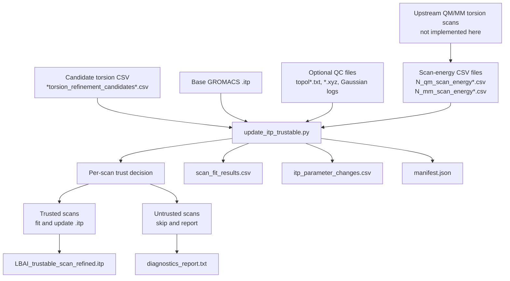
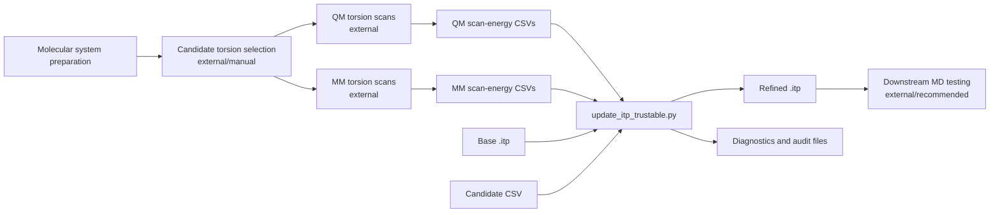

# Trustable QM/MM Torsion-Scan Refinement for GROMACS `.itp` Files


A conservative command-line utility for generating a **trustable torsion-refined GROMACS include topology (`.itp`)** from precomputed QM/MM torsion-scan data.

This repository is intended for use as a **publication companion workflow component** where torsion parameters are refined from scan-energy data, but only written into the topology when the corresponding scan passes explicit consistency and fit-quality checks.

> **Important scope note:** this repository currently provides a standalone `.itp` update and diagnostics script. It does **not** run Gaussian, GROMACS, HessFit, QM/MM calculations, or scan-energy extraction. Those upstream steps must be performed separately and their outputs placed in the expected data directory.

---

## Why this repository exists

Torsion refinement workflows often involve multiple files produced by separate tools: QM scan energies, MM scan energies, Gaussian logs, candidate torsions, molecular topologies, coordinate files, and GROMACS `.itp` parameters. Manual transfer of fitted torsion parameters into a force-field topology can easily introduce mistakes.

This repository addresses that handoff step by providing a script that:

- discovers candidate torsions and corresponding scan-energy files,
- fits a single periodic torsion term to the QM/MM residual scan profile,
- updates only trusted torsions in a GROMACS `.itp`,
- preserves skipped scans rather than forcing incomplete updates,
- emits machine-readable and human-readable diagnostics for auditability.

---

## Graphical abstract / workflow



---

## Repository scope

### Implemented

This repository implements a single command-line workflow:

| Component | Status | Description |
|---|---:|---|
| `update_itp_trustable.py` | Implemented | Reads candidate torsions, QM/MM scan-energy CSVs, optional diagnostic files, fits trusted torsions, and writes an updated GROMACS `.itp`. |
| Per-scan trust gating | Implemented | Requires scan files, compatible point counts, sufficient points, acceptable RMSE, and bounded force constant by default. |
| `.itp` dihedral-line replacement | Implemented | Updates matching proper-dihedral entries in the `[ dihedrals ]` section. |
| Diagnostics report | Implemented | Writes scan-level and global consistency information. |
| Manifest and CSV audit files | Implemented | Writes structured output summaries for reproducibility and downstream review. |

### Not implemented

The script does **not** perform the following steps:

- generation of QM torsion scans,
- generation of MM torsion scans,
- Gaussian execution,
- GROMACS execution,
- HessFit execution,
- automatic candidate torsion discovery from molecular structure,
- automatic production-MD validation,
- strict chemical validation of the final topology.

These steps are external to this repository and must be completed manually or by separate tools.

---

## Main script

### `update_itp_trustable.py`

Creates a torsion-refined GROMACS `.itp` file from files stored in a data directory, defaulting to:

```bash
./data
```

The script performs four major operations:

1. **Input discovery**
   - finds a base `.itp`,
   - finds a torsion candidate CSV,
   - locates QM and MM scan-energy CSV files for each candidate scan.

2. **Diagnostics**
   - checks missing scan files,
   - checks QM/MM point-count agreement,
   - summarizes Gaussian log status when logs are present,
   - compares `topol*.txt` bonds against `.itp` bonds when available,
   - compares `.xyz` element order against `.itp` atom order when available,
   - checks whether candidate central bonds appear in optional topology data.

3. **Torsion fitting**
   - computes a target profile from the QM/MM scan-energy difference,
   - fits one periodic cosine/sine term by least squares,
   - converts the fitted term into GROMACS proper-dihedral parameters.

4. **Conservative `.itp` update**
   - updates only trusted scans,
   - skips incomplete or poor-quality scans,
   - writes audit outputs describing every update and skip decision.

---

## Combined workflow concept

The intended full research workflow is conceptual and requires manual handoff between tools:



This repository implements the `update_itp_trustable.py` step only.

---

## Highlights

- **Conservative update policy:** incomplete, missing, high-RMSE, or overly large fitted parameters are skipped by default.
- **Audit-friendly outputs:** every scan receives a fit row, skip reason, and diagnostic summary.
- **Manual workflow compatible:** designed for projects where scan generation and energy extraction occur outside this repository.
- **Topology-aware checks:** optional comparison against `topol*.txt` and `.xyz` files can reveal atom-order or bond-list inconsistencies.
- **Publication-oriented traceability:** output files support reporting which torsions were updated, skipped, or require rerun.

---

## Code-to-README validation note

This README describes behavior implemented in `update_itp_trustable.py`. Statements about fitting, file discovery, default thresholds, diagnostics, and output files are derived from the source code. Claims about upstream QM/MM generation, HessFit execution, molecular validation, and production simulation are intentionally limited because those operations are not implemented in the uploaded script.

---

## Input data expectations

By default, the script expects all input files to be placed in:

```text
./data
```

### Required inputs

| Input | Requirement | Notes |
|---|---|---|
| Base `.itp` file | Required | Auto-discovered unless `--base-itp` is supplied. |
| Candidate torsion CSV | Required | Auto-discovered unless `--candidates` is supplied. |
| QM scan-energy CSVs | Required for each trusted scan | Pattern: `N_qm_scan_energy*.csv`. |
| MM scan-energy CSVs | Required for each trusted scan | Pattern: `N_mm_scan_energy*.csv`. |

### Optional diagnostic inputs

| Input | Purpose |
|---|---|
| `topol*.txt` | Optional bond-list comparison against the `.itp`. |
| `*.xyz` | Optional atom-count and element-order comparison against the `.itp`. |
| `N_qm*.log` | Optional Gaussian QM log diagnostics. |
| `N_mm_*.log` | Optional Gaussian MM log diagnostics. |

Optional files are used for reporting and quality control. They do not, by themselves, guarantee that an update is chemically valid.

---

## Candidate CSV format

The candidate CSV must contain:

| Column | Required | Description |
|---|---:|---|
| `scan_torsion` | Yes | Four atom indices defining the scanned torsion. |
| `central_bond` | No | Two atom indices for the central bond. If absent or invalid, the script uses atoms 2 and 3 from `scan_torsion`. |
| `itp_phi0_deg` or `original_itp_phi0_deg` | No | Original phase in degrees. Default: `180.0`. |
| `itp_cp` or `original_itp_cp_kj_mol` | No | Original force constant in kJ/mol. Default: `0.0`. |
| `itp_mult` or `original_itp_mult` | No | Original multiplicity. Default: `2`. |
| `central_bond_atom_names` | No | Stored for traceability. |
| `central_bond_atom_types` | No | Stored for traceability. |
| `raw_itp_line` | No | Stored for traceability. |

The scan index is assigned from the candidate CSV row number, starting at `0`. For example, row `3` corresponds to files such as:

```text
3_qm_scan_energy.csv
3_mm_scan_energy.csv
```

Versioned files such as `3_mm_scan_energy(1).csv` are accepted, and the script prefers higher parenthesized versions and newer modification times.

---

## Scan-energy CSV format

The scan-energy readers accept numeric rows separated by commas, spaces, or tabs. Blank lines and lines beginning with `#` are ignored.

### QM scan-energy files

Expected pattern:

```text
N_qm_scan_energy*.csv
```

Expected numeric columns:

```text
angle energy
```

The first column is interpreted as the torsion angle in degrees. The second column is interpreted according to `--qm-unit`.

Default:

```bash
--qm-unit kcal
```

Supported QM units:

| Unit | Interpretation |
|---|---|
| `kcal` | Energy values are used directly as relative kcal/mol values. |
| `kj` | Energy values are converted from kJ/mol to kcal/mol. |
| `hartree` | Energies are shifted by their minimum and converted to kcal/mol. |

### MM scan-energy files

Expected pattern:

```text
N_mm_scan_energy*.csv
```

Typical numeric columns:

```text
point_index energy
```

The second column is interpreted according to `--mm-unit`.

Default:

```bash
--mm-unit hartree
```

Supported MM units:

| Unit | Interpretation |
|---|---|
| `hartree` | Energies are shifted by their minimum and converted to kcal/mol. |
| `kcal` | Energies are shifted by their minimum. |
| `kj` | Energies are shifted by their minimum and converted to kcal/mol. |
| `auto` | Uses a magnitude heuristic to choose between Hartree-like and kcal-like values. |

---

## Fitting method

For each candidate scan with readable QM and MM data, the script constructs a target profile:

```text
target = QM_relative_energy - MM_relative_energy
```

It then fits a single periodic term of the form:

```text
target ≈ C + A cos(nφ) + B sin(nφ)
```

The fitted coefficients are converted to GROMACS function-1-style proper-dihedral parameters:

```text
V = k * (1 + cos(nφ - phase))
```

The fitted values written to the `.itp` are:

| Parameter | Meaning |
|---|---|
| `phase_deg` | Fitted phase angle in degrees. |
| `k_kj_mol` | Fitted torsional force constant in kJ/mol. |
| `multiplicity` | Original, fixed, or best-fit multiplicity depending on `--fit-mult`. |

### Multiplicity modes

| Option | Behavior |
|---|---|
| `--fit-mult original` | Uses the multiplicity from the candidate CSV. This is the default. |
| `--fit-mult best` | Tests multiplicities from `1` to `--max-mult` and chooses the lowest RMSE. |
| `--fit-mult N` | Uses integer multiplicity `N`. |

---

## Trust and decision logic

A scan is considered trusted only if it passes the script’s default gates.

### Default trust requirements

| Requirement | Default |
|---|---:|
| QM scan-energy CSV exists | Required |
| MM scan-energy CSV exists | Required |
| QM/MM point counts match | Required |
| Usable scan points | At least `11` |
| Fit RMSE | `≤ 15.0 kJ/mol` |
| Fitted force constant | `≤ 250.0 kJ/mol` |
| At least enough points to fit | Required |

Default thresholds:

```bash
--expected-points 11
--rmse-max-kj 15.0
--k-max-kj 250.0
```

### Relaxing trust gates

The script allows selected gates to be relaxed:

```bash
--allow-high-rmse
--allow-incomplete
```

Use these options cautiously. They change which scans may be written into the `.itp`.

### Strict mode

To abort unless all scans are trusted:

```bash
--require-all
```

When `--require-all` is used and untrusted scans remain, the script writes diagnostics and a manifest with `status: aborted`, then exits before writing the updated `.itp`.

---

## `.itp` update behavior

The script updates matching torsion lines in the `[ dihedrals ]` section of the base `.itp`.

A dihedral line is considered updateable when it has the expected numeric token structure:

```text
i j k l funct phase k multiplicity
```

The script:

- matches candidate torsions by atom index,
- also matches reversed torsion order by default,
- skips likely impropers using the implemented function-type check,
- writes updated proper-dihedral parameters only for trusted scans,
- annotates updated lines with scan index, central bond, and RMSE.

The base `.itp` is copied into the output directory as a `.bak` file unless `--no-backup` is supplied.

---

## Outputs

By default, outputs are written to:

```text
./data/itp_update_output
```

### Output files

| File | Description |
|---|---|
| `LBAI_trustable_scan_refined.itp` | Updated GROMACS include topology. |
| `<base-itp-name>.bak` | Backup copy of the base `.itp`, unless `--no-backup` is used. |
| `scan_fit_results.csv` | One row per candidate scan, including trust status, fitted values, RMSE, and skip reasons. |
| `itp_parameter_changes.csv` | One row per updated `.itp` line. |
| `diagnostics_report.txt` | Human-readable report summarizing global checks, scan fits, warnings, skipped scans, and interpretation guidance. |
| `manifest.json` | Machine-readable run summary including status, input files, output paths, trusted scans, and skipped scans. |

---

## Suggested repository layout

```text
.
├── README.md
├── update_itp_trustable.py
├── data/
│   ├── LBAI_HessFit_updated.itp
│   ├── LBAI_torsion_refinement_candidates.csv
│   ├── 0_qm_scan_energy.csv
│   ├── 0_mm_scan_energy.csv
│   ├── 1_qm_scan_energy.csv
│   ├── 1_mm_scan_energy.csv
│   ├── topol.txt
│   ├── LBAI.xyz
│   ├── 0_qm.log
│   ├── 0_mm_0.log
│   └── itp_update_output/
│       ├── LBAI_trustable_scan_refined.itp
│       ├── scan_fit_results.csv
│       ├── itp_parameter_changes.csv
│       ├── diagnostics_report.txt
│       └── manifest.json
└── environment.yml
```

This layout is suggested for publication-readiness. The script itself only requires the Python file and appropriate input files.

---

## Suggested software environment

The script requires Python and NumPy.

### Minimal installation

```bash
python -m venv .venv
source .venv/bin/activate
pip install numpy
```

On Windows PowerShell:

```powershell
python -m venv .venv
.venv\Scripts\Activate.ps1
pip install numpy
```

### Minimal `environment.yml`

```yaml
name: itp-trustable-refinement
channels:
  - conda-forge
dependencies:
  - python>=3.9
  - numpy
```

The script uses only one non-standard Python dependency:

| Dependency | Used for |
|---|---|
| `numpy` | Numeric arrays and least-squares fitting. |

Standard-library modules such as `argparse`, `csv`, `json`, `math`, `re`, `shutil`, `dataclasses`, and `pathlib` are also used but do not need separate installation.

---

## Quick start

Place the required data files in `./data`, then run:

```bash
python update_itp_trustable.py --data ./data
```

The default output topology is:

```text
./data/itp_update_output/LBAI_trustable_scan_refined.itp
```

Inspect the diagnostics before using the topology:

```bash
cat ./data/itp_update_output/diagnostics_report.txt
```

Review the fitted scan table:

```bash
cat ./data/itp_update_output/scan_fit_results.csv
```

Review the updated `.itp` lines:

```bash
cat ./data/itp_update_output/itp_parameter_changes.csv
```

---

## Common command examples

### Use a specific base `.itp`

```bash
python update_itp_trustable.py \
  --data ./data \
  --base-itp LBAI_HessFit_updated.itp
```

### Use a specific candidate CSV

```bash
python update_itp_trustable.py \
  --data ./data \
  --candidates LBAI_torsion_refinement_candidates.csv
```

### Write outputs to a custom directory

```bash
python update_itp_trustable.py \
  --data ./data \
  --out-dir ./results/itp_update
```

### Require every candidate scan to pass trust checks

```bash
python update_itp_trustable.py \
  --data ./data \
  --require-all
```

### Allow high-RMSE fits to update the `.itp`

```bash
python update_itp_trustable.py \
  --data ./data \
  --allow-high-rmse
```

### Allow mismatched QM/MM point counts

```bash
python update_itp_trustable.py \
  --data ./data \
  --allow-incomplete
```

### Search multiplicities from 1 to 6

```bash
python update_itp_trustable.py \
  --data ./data \
  --fit-mult best \
  --max-mult 6
```

### Use a fixed multiplicity

```bash
python update_itp_trustable.py \
  --data ./data \
  --fit-mult 3
```

---

## How to use the workflows together

A typical manual workflow is:

1. Generate or curate a candidate torsion CSV.
2. Generate QM scan-energy CSVs externally.
3. Generate MM scan-energy CSVs externally.
4. Place all files in `./data`.
5. Run `update_itp_trustable.py`.
6. Inspect:
   - `diagnostics_report.txt`,
   - `scan_fit_results.csv`,
   - `itp_parameter_changes.csv`,
   - `manifest.json`.
7. Use the updated `.itp` only if the trusted/skipped scan pattern is chemically acceptable.
8. Perform downstream molecular simulation checks externally.

The script’s final warning should be taken seriously: if scans are skipped, inspect the diagnostics before production MD.

---

## Reproducibility notes

For publication use, archive the following files with the generated topology:

```text
base .itp
candidate CSV
QM scan-energy CSVs
MM scan-energy CSVs
diagnostics_report.txt
scan_fit_results.csv
itp_parameter_changes.csv
manifest.json
```

Recommended additional metadata:

- software versions used to generate QM and MM scan energies,
- Gaussian route sections or equivalent QM settings,
- MM force-field version,
- atom-indexing convention,
- scan angle grid,
- unit conventions for all scan-energy files,
- date and Git commit hash of this script,
- downstream validation protocol.

The script writes a `manifest.json`, but it does not currently record the Git commit, Python version, NumPy version, or upstream software versions.

---

## Methodological contribution and interpretation

This repository contributes a conservative, auditable handoff layer between torsion-scan fitting data and GROMACS topology modification.

Its methodological value is not that it automates the entire QM/MM refinement pipeline, but that it makes the topology-editing step:

- explicit,
- reproducible,
- scan-indexed,
- threshold-gated,
- inspectable after execution.

The generated `.itp` should be interpreted as a **candidate refined topology**, not as a validated final force field. Chemical and simulation-level validation remain necessary.

---

## Limitations

- Only one Python script is currently provided.
- The workflow assumes precomputed scan-energy CSV files.
- Gaussian logs are inspected only if present; the script does not run Gaussian.
- GROMACS files are edited textually; the script does not run GROMACS validation.
- Optional `topol*.txt` and `.xyz` checks are diagnostic and do not by themselves prevent updates.
- Log diagnostics are reported but are not the primary trust gate for fitting.
- The fitting model is a single periodic torsion term per scan.
- The script does not resolve conflicting torsion scans that map to the same `.itp` line beyond its implemented matching behavior.
- The output topology should not be used for production MD without scientific review and downstream validation.
- Exact environment reproducibility is not guaranteed unless the user supplies environment and version-lock files.

---

## Recommended additions for publication readiness

Before using this repository as a manuscript companion, consider adding:

- `environment.yml` or `requirements.txt`,
- example input data with a small test molecule,
- expected output files for regression testing,
- unit tests for parsers and fitting behavior,
- CI checks for command-line execution,
- a license file,
- a citation file such as `CITATION.cff`,
- versioned releases,
- example figures comparing QM, MM, and fitted residual profiles,
- a short methods note explaining upstream scan generation.

---

## Example citation block

```bibtex
@software{trustable_itp_torsion_refinement,
  title        = {Trustable QM/MM Torsion-Scan Refinement for GROMACS ITP Files},
  author       = {Your Name and Contributors},
  year         = {2026},
  url          = {https://github.com/your-username/your-repository},
  note         = {Research utility for conservative torsion-parameter updates from precomputed QM/MM scan-energy data}
}
```

Replace the placeholder metadata with the final repository authors, year, DOI, and URL.

---

## Acknowledgments

This repository is designed for workflows involving QM/MM torsion scans, GROMACS topology files, and Gaussian-style log diagnostics. The script does not redistribute or invoke those external programs.

---

## Maintainer note

This README is intentionally conservative. It distinguishes implemented behavior from the broader conceptual refinement workflow so that users can audit what the script actually performs and what remains the responsibility of upstream data generation and downstream validation.
