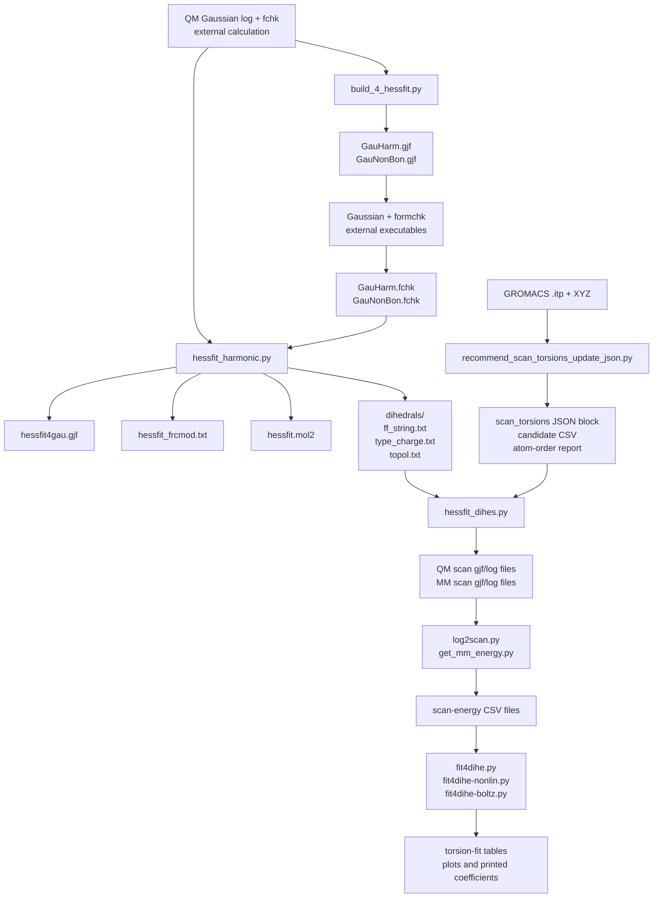
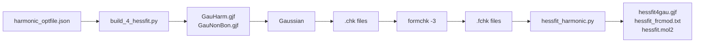

# HessFit Research Toolkit


A Python toolkit for **Hessian-derived bonded parameter fitting** and **torsion-scan preparation/fitting** around Gaussian/AMBER-style molecular mechanics workflows.

The repository contains scripts for:

- building Gaussian helper input files from QM log/fchk data,
- deriving bonded force-field terms from Hessian information,
- writing AMBER-style `frcmod`, Gaussian Amber input, MOL2, and topology helper files,
- preparing and running Gaussian torsion scans,
- extracting scan energies from Gaussian logs,
- fitting OPLS/Ryckaert–Bellemans-like torsion profiles,
- recommending torsions to scan from a GROMACS `.itp` file and matching `.xyz` coordinates.

> **Scope note:** this is a collection of research workflow scripts, not a fully packaged turnkey application. Several scripts are standalone command-line utilities. Some workflows call other scripts by filename and assume a configured Gaussian installation and executable scripts on `PATH`.

---

## Why this repository exists

Force-field parameterization often requires manual handoff between QM calculations, molecular-mechanics templates, Gaussian input files, Hessian data, topology files, and torsion-scan outputs. This repository provides scripts that make those handoffs more explicit for a HessFit-style workflow.

The code supports two related use cases:

1. **Harmonic Hessian workflow**  
   Generate Gaussian Amber helper calculations, read QM/MM/nonbonded Hessian information, and write AMBER-style bonded parameters.

2. **Torsion refinement workflow**  
   Select torsions, generate Gaussian scan inputs, extract QM/MM scan energies, and fit torsional profiles.

The scripts should be treated as **research utilities**. Generated parameters require chemical review and independent validation before production simulation.

---

## Graphical abstract



---

## Repository scope

### Implemented in the code

| Capability | Implemented? | Notes |
|---|---:|---|
| Gaussian helper input generation for harmonic/nonbonded calculations | Yes | `build_4_hessfit.py` writes `GauHarm.gjf` and `GauNonBon.gjf`. |
| Full harmonic driver | Partly | `hessfit.py` orchestrates build → Gaussian → formchk → harmonic fitting, assuming external Gaussian and script executability. |
| Hessian-derived bonded parameter writing | Yes | `hessfit_harmonic.py`, `force_constant_mod.py`, `seminario_module.py`, and `print_top.py`. |
| Gaussian RIC/topology parsing | Yes | `parser_gau.py`, `log2topol.py`. |
| Atom typing heuristics | Yes | `geom2atype.py`; supports internal GAFF/AMBER-like heuristic typing modes. |
| Torsion scan input generation and execution | Partly | `hessfit_dihes.py` writes and runs Gaussian inputs, but contains a hard-coded Gaussian 09 path. |
| Scan-energy extraction | Yes | `log2scan.py` for QM scan logs, `get_mm_energy.py` for MM/QM energy lines. |
| Torsion fitting | Yes | Several separate scripts fit OPLS/Ryckaert–Bellemans-like profiles. |
| Recommended scan torsion selection from `.itp` + `.xyz` | Yes | `recommend_scan_torsions_update_json.py`. |
| Final automatic insertion of fitted torsion parameters into `.itp` | No | Fitting scripts print/write fitted data but do not update a GROMACS topology. |
| Production simulation validation | No | Must be performed separately. |

### Not implemented

The repository does **not** provide:

- a formal Python package with `setup.py`/`pyproject.toml`,
- unit tests,
- continuous integration,
- complete environment locking,
- automatic Gaussian installation or license handling,
- automatic GROMACS/AMBER validation,
- a guaranteed end-to-end workflow for every system without manual inspection.

---

## Repository contents

The archive contains active scripts, historical backup files, and Python bytecode caches. For a clean public repository, keep the active `.py` files and remove `__pycache__/` and most `*.bak*` files unless the backups are intentionally preserved as development history.

### Primary workflow scripts

| Script | Role |
|---|---|
| `hessfit.py` | High-level harmonic driver: builds Gaussian helper inputs, runs Gaussian/formchk, then runs harmonic fitting. |
| `build_4_hessfit.py` | Builds `GauHarm.gjf` and `GauNonBon.gjf` from a QM log/fchk pair and JSON options. |
| `hessfit_harmonic.py` | Reads QM/MM/nonbonded Hessian data and writes AMBER/Gaussian/MOL2/topology outputs. |
| `hessfit_dihes.py` | Prepares torsion scan inputs, runs Gaussian scans/optimizations, extracts scan energies, and calls `fit4dihe.py`. |
| `recommend_scan_torsions_update_json.py` | Recommends scan torsions from a GROMACS `.itp` and matching `.xyz`, optionally updating a dihedral JSON file. |

### Scan and fitting utilities

| Script | Role |
|---|---|
| `log2scan.py` | Extracts completed QM scan points from a Gaussian log and writes relative kcal/mol energies. |
| `get_mm_energy.py` | Extracts MM or QM energy lines from Gaussian logs and writes a CSV. |
| `fit4dihe.py` | Fits OPLS-like and Ryckaert–Bellemans-like torsion profiles by linear least squares. |
| `fit4dihe-nonlin.py` | Fits OPLS/Ryckaert–Bellemans-like profiles with optional weighting and optional nonlinear OPLS phase fitting. |
| `fit4dihe-boltz.py` | Performs Boltzmann-weighted OPLS fitting over a hard-coded set of temperatures. |

### Parsing, topology, and parameter helpers

| Script | Role |
|---|---|
| `parser_gau.py` | Gaussian log/fchk parsing utilities, including coordinates, Hessians, RIC topology, charges, and Amber VDW lookup. |
| `log2topol.py` | Extracts redundant internal coordinate topology from a Gaussian log and writes `topol.txt`. |
| `print_top.py` | Writes Gaussian Amber input, AMBER-style `frcmod`, MOL2, and dihedral-helper files. |
| `force_constant_mod.py` | Builds bond, angle, and torsion parameter arrays from geometry/Hessian-derived quantities. |
| `seminario_module.py` | Modified Seminario-style bond/angle force constant helpers. |
| `average_across_types.py` | Duplicate/type averaging utilities. |
| `geom2atype.py` | Heuristic atom typing and aromatic/ring detection helpers. |
| `vdwparms.py` | Internal fallback VDW parameter table generation for Gaussian Amber-style input. |
| `get_amass.py` | Atomic mass lookup table. |
| `guessBO.py` | Simple bond-order guessing helper for MOL2 writing. |

### Format conversion and small utilities

| Script | Role |
|---|---|
| `pdb2xyz.py` | Converts PDB coordinates to XYZ. |
| `gau2xyz.py` | Reads optimized coordinates from Gaussian-style text and prints XYZ-like content. |
| `gauScan2com.py` | Converts Gaussian scan log geometries into Gaussian MM input files. |
| `change_mmCOM.py` | Modifies a Gaussian MM input file using a hard-coded torsion/angle index pattern. |
| `doublecheck.py` | Removes duplicate lines from a file in place. |
| `temp-atpye.py` | Small scratch/testing script for atom typing. |

---

## Suggested clean repository layout

```text
hessfit/
├── README.md
├── hessfit.py
├── build_4_hessfit.py
├── hessfit_harmonic.py
├── hessfit_dihes.py
├── recommend_scan_torsions_update_json.py
├── log2scan.py
├── get_mm_energy.py
├── fit4dihe.py
├── fit4dihe-nonlin.py
├── fit4dihe-boltz.py
├── parser_gau.py
├── log2topol.py
├── print_top.py
├── force_constant_mod.py
├── seminario_module.py
├── average_across_types.py
├── geom2atype.py
├── vdwparms.py
├── get_amass.py
├── guessBO.py
├── pdb2xyz.py
├── gau2xyz.py
├── gauScan2com.py
├── change_mmCOM.py
├── doublecheck.py
├── examples/
│   ├── harmonic_optfile.json
│   ├── dihe_optfile.json
│   └── README.md
└── tests/
```

Recommended cleanup before publication:

```bash
rm -rf __pycache__
rm -f *.pyc
```

Keep `*.bak*` files only if they document intentionally preserved development variants.

---

## Software environment

### Python dependencies

The active scripts use the following non-standard Python packages:

| Package | Used by |
|---|---|
| `numpy` | Most numerical scripts. |
| `pandas` | Scan-energy extraction/fitting scripts and `hessfit_dihes.py`. |
| `scipy` | `hessfit_harmonic.py`, `fit4dihe-nonlin.py`, `fit4dihe-boltz.py`. |
| `matplotlib` | Torsion fitting plots. |

Install with:

```bash
python -m venv .venv
source .venv/bin/activate
pip install numpy pandas scipy matplotlib
```

A minimal Conda-style environment file would be:

```yaml
name: hessfit
channels:
  - conda-forge
dependencies:
  - python>=3.9
  - numpy
  - pandas
  - scipy
  - matplotlib
```

### External software

The harmonic and torsion workflows assume external executables:

| External software | Required for |
|---|---|
| Gaussian 09 or Gaussian 16 | Running `.gjf` files and generating `.log`, `.chk`, `.fchk` data. |
| `formchk` | Converting Gaussian checkpoint files to formatted checkpoint files. |
| AMBER/tleap | Not run by the scripts, but `tleap.in` is generated for downstream use. |
| GROMACS | Not run by the scripts; `.itp` is parsed only by the scan recommendation utility. |

The code does not install or license Gaussian, AMBER, or GROMACS.

---

## Installation and command setup

Because several scripts call each other by filename, the most robust setup is to run from the repository directory and add it to `PATH`.

```bash
cd hessfit

chmod +x *.py
export PATH="$PWD:$PATH"
```

For Gaussian path discovery, the code uses a mixture of environment variables and command-line paths.

Recommended environment setup for Gaussian 09:

```bash
export g09root=/path/to/gaussian/root
export GAUSS_EXEDIR="$g09root/g09"
export PATH="$GAUSS_EXEDIR:$PATH"
```

Recommended environment setup for Gaussian 16:

```bash
export g16root=/path/to/gaussian/root
export GAUSS_EXEDIR="$g16root/g16"
export PATH="$GAUSS_EXEDIR:$PATH"
```

The expected layout is typically:

```text
/path/to/gaussian/root/
└── g09/
    ├── g09
    ├── formchk
    └── amber.prm
```

or:

```text
/path/to/gaussian/root/
└── g16/
    ├── g16
    ├── formchk
    └── amber.prm
```

---

# Detailed user manual

## 1. Prepare input files for harmonic fitting

The harmonic workflow expects a QM Gaussian log file and a QM formatted checkpoint file. Depending on the entry point, it may also expect MM and nonbonded formatted checkpoint files.

### Harmonic JSON option file

A practical harmonic option file should include:

```json
{
  "files": {
    "log_qm_file": "qm.log",
    "fchk_qm_file": "qm.fchk",
    "fchk_mm_file": "GauHarm.fchk",
    "fchk_nb_file": "GauNonBon.fchk"
  },
  "charge": 0,
  "multiplicity": 1,
  "opt": "ric",
  "mode": "mean",
  "mem": "8GB",
  "nprocs": 8
}
```

### Field meanings

| Field | Used by | Meaning |
|---|---|---|
| `files.log_qm_file` | build/harmonic scripts | Gaussian QM log file containing topology/charge information. |
| `files.fchk_qm_file` | build/harmonic scripts | Gaussian QM formatted checkpoint file. |
| `files.fchk_mm_file` | `hessfit_harmonic.py` | Formatted checkpoint from the harmonic MM helper calculation. |
| `files.fchk_nb_file` | `hessfit_harmonic.py` | Formatted checkpoint from the nonbonded helper calculation. |
| `charge` | build/harmonic scripts | Formal molecular charge written into Gaussian input. |
| `multiplicity` | build/harmonic scripts | Spin multiplicity written into Gaussian input. |
| `opt` | harmonic scripts | Fitting mode. Code branches on `modsem`; other values use RIC Hessian logic. |
| `mode` | parameter reduction | `mean` averages duplicate atom-type terms; `all` preserves all terms. |
| `mem` | build/dihedral scripts | Gaussian `%mem` value. |
| `nprocs` | build/dihedral scripts | Gaussian `%nprocshared` value. |

### Important note on charges

`parser_gau.py` attempts to read CM5 charges from the QM log and falls back to Mulliken-style sections. If the expected charge table is not found, some scripts substitute temporary zero charges and print warnings. These fallback charges are for workflow continuity only and should not be treated as final production charges.

---

## 2. Build Gaussian helper input files

Use `build_4_hessfit.py` to write:

- `GauHarm.gjf`
- `GauNonBon.gjf`

Example:

```bash
python build_4_hessfit.py harmonic_optfile.json \
  --version g09 \
  --path /path/to/gaussian/root \
  --at gaff
```

Atom typing options:

| Option | Meaning |
|---|---|
| `--at gaff` | Use internal GAFF-like heuristic atom typing. Default. |
| `--at amber` | Use internal AMBER-like heuristic atom typing. |
| `--at scratch` | Generate simple element-index atom types such as `C0`, `H1`, etc. |

Gaussian version options:

```bash
--version g09
--version g16
```

`--path` should point to the Gaussian root directory that contains the selected version subdirectory.

### Outputs

| Output | Description |
|---|---|
| `GauHarm.gjf` | Gaussian Amber helper input with bonded terms enabled and nonbonded master function. |
| `GauNonBon.gjf` | Gaussian Amber helper input with VDW/nonbonded terms and zeroed bond/angle/torsion constants. |

The script reads `amber.prm` from the Gaussian version directory. If no matching Amber VDW entries are found for the assigned atom types, `parser_gau.py` falls back to internal GAFF-like VDW parameter generation through `vdwparms.py`.

---

## 3. Run Gaussian helper jobs and formchk

The code can run Gaussian through `hessfit.py`, but the steps can also be run manually for better transparency.

Manual execution:

```bash
g09 GauHarm.gjf
g09 GauNonBon.gjf

formchk -3 GauHarm.chk GauHarm.fchk
formchk -3 GauNonBon.chk GauNonBon.fchk
```

For Gaussian 16, replace `g09` with `g16`.

Make sure the paths in `harmonic_optfile.json` point to the generated formatted checkpoint files:

```json
{
  "files": {
    "fchk_mm_file": "GauHarm.fchk",
    "fchk_nb_file": "GauNonBon.fchk"
  }
}
```

---

## 4. Run harmonic parameter fitting

After QM, MM, and nonbonded `.fchk` files are available, run:

```bash
python hessfit_harmonic.py harmonic_optfile.json \
  --version g09 \
  --at gaff
```

### What it does

`hessfit_harmonic.py`:

1. reads QM log and fchk files,
2. reads MM and nonbonded fchk files,
3. extracts Gaussian redundant internal coordinate dimensions,
4. reads RIC or Cartesian Hessian data,
5. subtracts the nonbonded Hessian contribution,
6. derives bond/angle/torsion terms,
7. averages or preserves duplicated atom-type terms depending on `mode`,
8. writes Gaussian, AMBER-style, MOL2, and dihedral-helper outputs.

### Outputs

| Output | Description |
|---|---|
| `hessfit4gau.gjf` | Gaussian Amber-style input containing the fitted force-field terms. |
| `hessfit_frcmod.txt` | AMBER-style force modification file. |
| `hessfit.mol2` | MOL2 structure with atom types and charges. |
| `tleap.in` | Minimal tleap input file. |
| `dihedrals/ff_string.txt` | Force-field block extracted from `hessfit4gau.gjf`. |
| `dihedrals/type_charge.txt` | Atom type/charge list for scan utilities. |
| `dihedrals/topol.txt` | Bond/angle/torsion topology extracted from the Gaussian log. |

### Environment caution

`hessfit_harmonic.py` calls Gaussian-path helper logic internally. In the current code, it is safest to ensure `g09root` or `g16root` is set in the environment before running this script.

---

## 5. Run the high-level harmonic driver

The high-level driver is:

```bash
python hessfit.py harmonic_optfile.json \
  --version g09 \
  --path /path/to/gaussian/root \
  --at gaff
```

With the optional Gaussian test calculation:

```bash
python hessfit.py harmonic_optfile.json \
  --version g09 \
  --path /path/to/gaussian/root \
  --at gaff \
  --test True
```

### What `hessfit.py` orchestrates



### Practical caution

`hessfit.py` calls subordinate scripts by filename, for example `build_4_hessfit.py` and `hessfit_harmonic.py`. This requires the scripts to be executable and visible on `PATH`. For non-default Gaussian layouts, manual execution of the individual steps may be easier to audit.

---

## 6. Convert PDB to XYZ

If an XYZ coordinate file is needed:

```bash
python pdb2xyz.py molecule.pdb molecule.xyz
```

If the PDB coordinates are in bohr rather than Å:

```bash
python pdb2xyz.py molecule.pdb molecule.xyz --bohr-to-ang
```

Output:

```text
molecule.xyz
```

The XYZ output stores atom symbols and coordinates only. Bonds and topology must come from other files such as `topol.txt` or `.itp`.

---

## 7. Recommend torsions to scan from `.itp` and `.xyz`

Use:

```bash
python recommend_scan_torsions_update_json.py molecule.itp molecule.xyz
```

With a custom output prefix:

```bash
python recommend_scan_torsions_update_json.py molecule.itp molecule.xyz \
  --prefix molecule
```

### What it does

The script:

1. parses `[ atoms ]`, `[ bonds ]`, and `[ dihedrals ]` sections from a GROMACS `.itp`,
2. parses matching XYZ coordinates,
3. checks atom count and element order,
4. detects ring edges and ring atoms from the bond graph,
5. identifies non-ring heavy-heavy bridge bonds between ring atoms,
6. scores candidate proper dihedrals,
7. recommends up to `--max-per-bond` scan torsions for each selected central bond.

By default, only proper dihedral function numbers:

```text
1,3,4,5,9
```

are considered.

### Useful options

| Option | Meaning |
|---|---|
| `--max-per-bond 2` | Keep up to two representative torsions per central bond. |
| `--proper-functs 1,9` | Restrict accepted `.itp` proper dihedral function numbers. |
| `--include-nonring-rotors` | Also include non-ring heavy-heavy rotatable bonds, not only ring-bridge bonds. |
| `--json-only` | Print only the `scan_torsions` JSON block. |
| `--update-json dihe_optfile.json` | Insert the recommended torsions into a dihedral JSON file. |
| `--yes` | Overwrite existing `scan_torsions` without interactive confirmation. |
| `--dry-run` | Preview JSON update without writing. |
| `--no-backup` | Do not write a `.bak` backup when updating JSON. |

### Outputs

For prefix `molecule`, the script writes:

| Output | Description |
|---|---|
| `molecule_scan_torsions.json` | JSON block containing recommended `scan_torsions`. |
| `molecule_torsion_refinement_candidates.csv` | Candidate and scoring table. |
| `molecule_atom_order_check.txt` | Atom-count and element-order diagnostics. |

Example JSON block:

```json
{
  "scan_torsions": [
    [5, 7, 12, 13]
  ]
}
```

Each list `[i, j, k, l]` corresponds to a Gaussian ModRedundant line:

```text
D i j k l
```

The central scanned bond is `j-k`.

---

## 8. Prepare the dihedral scan option file

`hessfit_dihes.py` uses a separate JSON format. Example:

```json
{
  "files": {
    "file_xyz": "molecule.xyz",
    "topol": "topol.txt",
    "atom2type": "type_charge.txt",
    "force_file": "ff_string.txt"
  },
  "nprocs": 8,
  "mem": "8GB",
  "method": "B3LYP/6-31G* EmpiricalDispersion=GD3",
  "scan_torsions": [
    [5, 7, 12, 13]
  ]
}
```

### Required files

| Field | Meaning |
|---|---|
| `file_xyz` | XYZ coordinate file. |
| `topol` | Topology text file containing bond, angle, and torsion lists. |
| `atom2type` | Atom type/charge text file, typically `dihedrals/type_charge.txt`. |
| `force_file` | Gaussian force-field text block, typically `dihedrals/ff_string.txt`. |

### Optional field

| Field | Meaning |
|---|---|
| `scan_torsions` | Explicit torsions to scan. If absent, the script chooses one representative torsion per unique element-pattern group. |

If using `recommend_scan_torsions_update_json.py`, the `--update-json` option can write this field automatically.

---

## 9. Run torsion scan generation and fitting

From the directory containing the dihedral inputs:

```bash
python hessfit_dihes.py dihe_optfile.json
```

### What it attempts to do

`hessfit_dihes.py`:

1. reads XYZ coordinates,
2. reads `topol.txt`,
3. chooses representative torsions or uses `scan_torsions`,
4. writes QM scan input files such as `0_qm.gjf`,
5. runs Gaussian QM scans,
6. reads scan geometries from QM logs,
7. writes MM Gaussian inputs for each scan point,
8. zeros the selected torsion term in the MM force-field block,
9. runs Gaussian MM optimizations,
10. extracts QM and MM scan energies,
11. merges scan energy files,
12. calls `fit4dihe.py`.

### Important implementation detail

The current `setup_gaussian_runner()` in `hessfit_dihes.py` is hard-coded to:

```text
/app/gaussian/g09/g09
/app/gaussian/g09/l1.exe
```

This means the script is not portable without editing the Gaussian path or matching that cluster layout.

### Expected scan outputs

Depending on scan count and Gaussian success, outputs may include:

| Pattern | Description |
|---|---|
| `N_qm.gjf` | QM torsion scan input for scan `N`. |
| `N_qm.log` | QM scan Gaussian log. |
| `N_mm_*.gjf` | MM input files generated from QM scan geometries. |
| `N_mm_*.log` | MM Gaussian logs. |
| `N_qm_scan_energy.csv` | Extracted QM scan energies. |
| `N_mm_scan_energy.csv` | Extracted MM energies. |
| `N_qm_all.csv` | Merged scan table used for fitting. |
| `oplsa_fitted.txt` | OPLS-like fit output from `fit4dihe.py`. |
| `rybe_fitted.txt` | Ryckaert–Bellemans-like fit output from `fit4dihe.py`. |
| `qm_rel.csv` | Relative QM energies written by `fit4dihe.py`. |
| `mm_rel.csv` | Relative MM energies written by `fit4dihe.py`. |

### Manual fallback

Because this script combines file generation, Gaussian execution, extraction, and fitting, a safer publication workflow is often to run these pieces manually and inspect each step:

```bash
python log2scan.py -t qm -f 0_qm.log -o 0_qm_scan_energy.csv
python get_mm_energy.py -t mm 0_mm_*.log -o 0_mm_scan_energy.csv
```

Then prepare a three-column scan table and run one of the fitting scripts.

---

## 10. Extract QM scan energies manually

Use `log2scan.py` for Gaussian QM scan logs:

```bash
python log2scan.py \
  -t qm \
  -f 0_qm.log \
  -o 0_qm_scan_energy.csv
```

### What it extracts

`log2scan.py`:

- requires `Normal termination` in the Gaussian log,
- finds the internal coordinate marked as `Scan`,
- extracts one record per `Optimization completed.` section,
- uses the last preceding `SCF Done:` energy,
- writes relative energy in kcal/mol.

Output format:

```text
angle_deg,relative_energy_kcal_mol
```

Example:

```text
-166.19190000,0.0000000000
-130.21010000,1.2345678901
```

If the log contains `Optimization stopped.`, the script prints a warning.

---

## 11. Extract MM energies manually

Use `get_mm_energy.py`:

```bash
python get_mm_energy.py \
  -t mm \
  0_mm_*.log \
  -o 0_mm_scan_energy.csv
```

For QM-style `SCF Done:` lines:

```bash
python get_mm_energy.py \
  -t qm \
  0_qm.log \
  -o 0_qm_energy_lines.csv
```

The script sorts input files using a natural sort order before extraction.

Output is written with pandas `to_csv(header=None)`, so the file includes a row index and extracted energy value:

```text
0,-123.456789
1,-123.455001
```

---

## 12. Fit torsion scans

### Input table

The torsion fitting scripts expect a three-column table:

```text
angle  QM_energy  MM_energy
```

The table is read as whitespace-delimited by `fit4dihe.py`, `fit4dihe-nonlin.py`, and `fit4dihe-boltz.py`.

Example:

```text
-180.0  -123.456789  -123.120000
-144.0  -123.455000  -123.119000
-108.0  -123.452100  -123.118500
```

### Linear OPLS/RB fitting

```bash
python fit4dihe.py scan.dat
```

With plot:

```bash
python fit4dihe.py scan.dat --plot --name scan0
```

Outputs:

| Output | Description |
|---|---|
| `oplsa_fitted.txt` | Angle, QM relative energy, MM relative energy, fitted OPLS-like energy. |
| `rybe_fitted.txt` | Angle, QM relative energy, MM relative energy, fitted Ryckaert–Bellemans-like energy. |
| `qm_rel.csv` | Relative QM energies. |
| `mm_rel.csv` | Relative MM energies. |
| `scan0.png` | Plot, if `--plot` is used. |

### Linear, weighted, and nonlinear fitting

```bash
python fit4dihe-nonlin.py scan.dat \
  --model oplsa \
  --weighted \
  --nonlinear \
  --plot \
  --name scan0
```

Options:

| Option | Meaning |
|---|---|
| `--model oplsa` | Use OPLS-like design matrix. |
| `--model rybe` | Use Ryckaert–Bellemans-like design matrix. |
| `--weighted` | Use exponential weighting based on QM relative energy. |
| `--nonlinear` | For OPLS mode, fit amplitudes and phases by nonlinear least squares. |
| `--plot` | Save a PNG plot. |
| `--name scan0` | Output prefix. |

Outputs:

| Output | Description |
|---|---|
| `scan0_fitted.csv` | Linear or weighted fit table. |
| `scan0_nonlinear.csv` | Nonlinear fit table, if `--nonlinear` is used with OPLS. |
| `scan0.png` | Plot, if requested. |

### Boltzmann-weighted fitting

```bash
python fit4dihe-boltz.py scan.dat
```

The script loops over hard-coded temperatures:

```text
0, 500, 1000, 2000 K
```

and writes plots named:

```text
fit_oplsa_T<T>.png
```

It also prints AMBER-style `DIHE` terms. The atom-type label is currently hard-coded inside the script as:

```text
c -n -c3-os
```

For publication use, edit the atom-type label or treat the printed terms as a template rather than a final frcmod block.

---

## Output inventory by workflow

### Harmonic workflow

| File | Produced by | Interpretation |
|---|---|---|
| `GauHarm.gjf` | `build_4_hessfit.py` | Gaussian helper input for bonded/harmonic terms. |
| `GauNonBon.gjf` | `build_4_hessfit.py` | Gaussian helper input for nonbonded terms. |
| `GauHarm.fchk` | `formchk` external | MM helper formatted checkpoint. |
| `GauNonBon.fchk` | `formchk` external | Nonbonded helper formatted checkpoint. |
| `hessfit4gau.gjf` | `hessfit_harmonic.py` | Gaussian Amber input with fitted parameters. |
| `hessfit_frcmod.txt` | `hessfit_harmonic.py` | AMBER-style force-field modification file. |
| `hessfit.mol2` | `hessfit_harmonic.py` | MOL2 structure with atom types and charges. |
| `tleap.in` | `hessfit_harmonic.py` | Minimal tleap setup file. |
| `dihedrals/ff_string.txt` | `print_top.py` | Force-field block for scan utilities. |
| `dihedrals/type_charge.txt` | `print_top.py` | Atom type-charge list. |
| `dihedrals/topol.txt` | `log2topol.py` | Bond/angle/torsion topology list. |

### Torsion recommendation workflow

| File | Produced by | Interpretation |
|---|---|---|
| `<prefix>_scan_torsions.json` | `recommend_scan_torsions_update_json.py` | Recommended torsions as JSON. |
| `<prefix>_torsion_refinement_candidates.csv` | `recommend_scan_torsions_update_json.py` | Candidate torsion scoring table. |
| `<prefix>_atom_order_check.txt` | `recommend_scan_torsions_update_json.py` | ITP/XYZ element-order report. |

### Torsion fitting workflow

| File | Produced by | Interpretation |
|---|---|---|
| `N_qm_scan_energy.csv` | `log2scan.py` | Relative QM scan energies. |
| `N_mm_scan_energy.csv` | `get_mm_energy.py` | Extracted MM energies. |
| `oplsa_fitted.txt` | `fit4dihe.py` | OPLS-like fitted profile. |
| `rybe_fitted.txt` | `fit4dihe.py` | Ryckaert–Bellemans-like fitted profile. |
| `<name>_fitted.csv` | `fit4dihe-nonlin.py` | Fitted profile table. |
| `<name>_nonlinear.csv` | `fit4dihe-nonlin.py` | Nonlinear fitted profile table. |
| `<name>.png` | fitting scripts | Plot of QM/MM/fitted profiles. |

---

## File format references

### `topol.txt`

Written by `log2topol.py` as:

```text
<number_of_bonds>
i j
...
<number_of_angles>
i j k
...
<number_of_dihedrals>
i j k l
...
```

Example:

```text
2
 1 2
 2 3
1
 1 2 3
1
 1 2 3 4
```

### `type_charge.txt`

Written by `print_top.build_dihe_folder()` as:

```text
atomtype-charge
```

Example:

```text
c3-+0.123456
n--0.234567
```

### `ff_string.txt`

Written by `print_top.build_dihe_folder()` from the section of `hessfit4gau.gjf` after `!Master function`. It is reused by `gauScan2com.py` and `hessfit_dihes.py` when generating MM scan inputs.

### XYZ

Expected by `hessfit_dihes.py`:

```text
N
comment
Element x y z
Element x y z
...
```

### Three-column scan table

Expected by fitting scripts:

```text
angle_deg qm_energy mm_energy
```

The fitting scripts assume whitespace separation. If your merged scan table is comma-separated, convert it before fitting.

---

## Methodological notes

### Harmonic fitting logic

The harmonic workflow reads Gaussian Hessian information and constructs effective bonded terms. In RIC mode, the code subtracts the nonbonded Hessian from the QM Hessian and solves a diagonalized system against the MM Hessian for bond, angle, and torsion contributions. In `modsem` mode, Cartesian Hessian data are used with Modified Seminario-style helper functions for bond and angle force constants.

### Duplicate parameter handling

The `mode` option controls how terms are reduced:

| Mode | Behavior |
|---|---|
| `mean` | Average duplicate atom-type terms. |
| `all` | Preserve all terms without averaging. |

### Torsion fitting logic

The fitting scripts construct relative QM and MM energy profiles, fit the QM-MM residual with OPLS-like or Ryckaert–Bellemans-like basis functions, and write fitted profiles. They do not automatically insert the fitted torsion terms into `hessfit_frcmod.txt` or a GROMACS `.itp`.

---

## Reproducibility checklist

For a publication companion repository, archive the following with every parameter set:

- exact input QM `.log` and `.fchk`,
- Gaussian route sections and version,
- `harmonic_optfile.json`,
- generated `GauHarm.gjf` and `GauNonBon.gjf`,
- generated `GauHarm.fchk` and `GauNonBon.fchk`,
- final `hessfit_frcmod.txt`,
- final `hessfit.mol2`,
- scan torsion JSON,
- all QM/MM scan logs,
- all scan-energy CSV files,
- all fitting output tables and plots,
- exact Git commit or release tag,
- Python environment file,
- downstream validation protocol.

---

## Validation note

This README is derived from the code structure and implemented behavior in the provided archive. The claims are intentionally conservative:

- scripts are described as separate utilities unless the code explicitly orchestrates them,
- Gaussian, AMBER, and GROMACS execution are not claimed unless the script directly calls the executable,
- diagnostic utilities are not described as rigorous validation,
- known portability and workflow assumptions are documented.

---

## Known limitations and cautions

1. **Gaussian path handling is inconsistent across scripts.**  
   Some scripts accept `--path`; `hessfit_dihes.py` uses a hard-coded Gaussian 09 path under `/app/gaussian/g09`.

2. **Scripts call other scripts by filename.**  
   Commands such as `subprocess.run(["log2scan.py", ...])` require executable permissions and `PATH` setup.

3. **`hessfit_harmonic.py` relies on Gaussian environment variables.**  
   In the current code, `g09root` or `g16root` should be set before use.

4. **The dihedral workflow may need delimiter handling.**  
   `hessfit_dihes.py` writes merged scan data with pandas CSV defaults, while `fit4dihe.py` reads whitespace-delimited data. Users may need to convert comma-separated files before fitting.

5. **`fit4dihe-boltz.py` includes `T = 0` in its hard-coded temperature loop.**  
   The Boltzmann weight expression divides by temperature, so this case should be reviewed before relying on the output.

6. **Final topology update is not implemented.**  
   The torsion fitting scripts write fitted profiles and coefficients but do not automatically update `.itp` or `frcmod` files.

7. **Atom typing is heuristic.**  
   `geom2atype.py` implements internal atom typing logic, but this should not be treated as a replacement for expert force-field assignment.

8. **Charge fallback is temporary.**  
   Zero-charge fallbacks are used to avoid empty output files when charge parsing fails. Replace these with defensible charge assignments before production simulation.

9. **No test suite is included.**  
   The repository should be validated on known small molecules before publication use.

10. **Backup files and bytecode caches are present.**  
    Clean these before public release unless intentionally archived.

---

## Suggested publication-readiness additions

Before public release, consider adding:

- `LICENSE`,
- `CITATION.cff`,
- `environment.yml` or `requirements.txt`,
- a small reproducible example,
- expected output files for regression testing,
- unit tests for parsers and fitting utilities,
- a workflow tutorial with screenshots or plots,
- GitHub Actions for syntax and smoke tests,
- versioned releases,
- a clear statement of validated Gaussian versions,
- a table mapping fitted terms to force-field units.

---

## Example citation block

```bibtex
@software{hessfit_research_toolkit,
  title        = {HessFit Research Toolkit for Hessian-Derived Force-Field Parameterization},
  author       = {Your Name and Contributors},
  year         = {2026},
  url          = {https://github.com/your-username/hessfit},
  note         = {Research scripts for Gaussian/AMBER-style Hessian fitting and torsion-scan preparation}
}
```

Replace placeholder metadata with the final authors, repository URL, release version, and DOI if available.

---

## Acknowledgments

The script banners identify the original HessFit author as Emanuele Falbo. Additional patches in this archive appear to improve Gaussian parsing robustness, charge fallback behavior, atom typing, resource handling, and torsion-scan recommendation. Please preserve appropriate authorship and contribution history when preparing the public repository.

---

## Maintainer note

This README is written for a serious research repository. It intentionally distinguishes implemented behavior from conceptual workflow steps so that future users can reproduce the calculations, audit the generated files, and understand where manual validation remains necessary.
